# CADT Events — Database Administration
## Project Proposal and Progress Report

**Prepared by:** Database Administration Team  
**Institution:** Cambodia Academy of Digital Technology (CADT)  
**Date:** July 4, 2026  
**Status:** In Progress

---

## 1. Project Title

**CADT Events — Centralized University Event Management System**

A database-driven web platform for managing, discovering, and attending academic and professional events at CADT. The database layer serves as the authoritative source of truth for all system data, user records, bookings, attendance, and analytics.

---

## 2. Problem Statement

The Cambodia Academy of Digital Technology currently relies on public Telegram group channels to announce seminars, workshops, and academic events. This approach creates three measurable operational problems.

**Information loss.** Announcements are buried beneath ordinary chat messages. Students who mute large group channels miss critical academic and career opportunities without any recovery mechanism.

**Lack of structure.** There is no structured record of which students registered for which events, whether they attended, or what academic credits they earned. Attendance is tracked manually using paper sheets, which cannot be queried, exported, or analysed.

**Concurrency risk.** Manual registration through forms does not prevent two students from claiming the last seat in a high-demand workshop simultaneously. There is no reservation system to enforce capacity limits safely.

A well-designed relational database is the foundation needed to resolve all three problems.

---

## 3. Solution Overview

CADT Events introduces a relational PostgreSQL database that stores, enforces, and serves all platform data through a type-safe Prisma ORM layer connected to an Express.js backend API.

The database design enforces:

- Normalized entity relationships (Third Normal Form) across 19 tables
- Seat concurrency control through a timed reservation lock model
- A credit transaction ledger tied to verified attendance
- Role-based access control with five distinct privilege levels
- Soft deletion to preserve historical records without breaking foreign key integrity
- Automated Telegram notification delivery tracked per user preference

---

## 4. Project Objectives

### 4.1 Overall System Objectives

1. Replace fragmented Telegram announcements with a single, queryable event registry
2. Enable students to discover, register for, and receive reminders about events through a unified web interface
3. Provide administrators with real-time attendance tracking and one-click data export
4. Award and record academic credits automatically upon verified check-in
5. Support concurrent high-demand registrations without data corruption or double-booking

### 4.2 Database Administration Objectives

**Design and Structure**

- Define a complete Entity-Relationship Diagram covering all system entities and their relationships
- Produce DDL scripts implementing the full schema with appropriate data types and constraints
- Enforce all primary keys, foreign keys, unique constraints, NOT NULL constraints, and default values

**Security and Access Control**

- Implement five system roles: STUDENT, STAFF, ORGANIZER, ADMIN, SUPER_ADMIN
- Define privilege grants per role against each table
- Protect sensitive fields through appropriate encryption and token handling

**Implementation and Data Population**

- Produce a relational schema mapping all entities with defined keys and cardinalities
- Insert a minimum of 5,000 sample records representing realistic platform activity
- Execute and document backup, restore, and verification procedures

**Query and Optimization**

- Write queries for standard operational views and advanced analytics reports
- Create indexes on high-frequency lookup columns and document the performance improvement
- Connect the database to the Express.js application layer and verify all CRUD operations

---

## 5. System Requirements

### 5.1 Functional Requirements

| ID | Requirement |
|----|-------------|
| FR-01 | The system must store user accounts with roles, department affiliation, and credit balance |
| FR-02 | The system must support event creation with venue assignment, capacity limits, speaker attachments, and category tagging |
| FR-03 | The system must enforce a maximum of one confirmed booking per user per event |
| FR-04 | The system must lock a selected seat for 10 minutes during the booking flow and release it automatically on expiry |
| FR-05 | The system must record the exact timestamp when a student's QR code is scanned at check-in |
| FR-06 | The system must atomically increment a user's credit balance and log the transaction when check-in is recorded |
| FR-07 | The system must store a Telegram chat ID per user and support a one-time token flow for account linking |
| FR-08 | The system must allow soft deletion of users, events, and bookings without breaking referential integrity |
| FR-09 | The system must provide query views for event attendance rates, department engagement, and credit leaderboards |
| FR-10 | The system must support admin export of booking data in CSV format |

### 5.2 Non-Functional Requirements

| ID | Requirement |
|----|-------------|
| NFR-01 | All standard API queries must resolve in under 200 milliseconds under normal load |
| NFR-02 | The database must handle concurrent seat reservation requests without race conditions |
| NFR-03 | All password fields must be stored as bcrypt hashes — never in plain text |
| NFR-04 | All schema changes must be tracked through versioned migration files |
| NFR-05 | A full database backup must be recoverable and verifiable before any production deployment |

---

## 6. Main Tables and Their Purpose

| Table | Primary Purpose |
|-------|----------------|
| `departments` | Stores academic and administrative units at CADT |
| `users` | Stores all platform accounts — students, staff, organizers, and admins |
| `speakers` | Stores speaker profiles attached to events |
| `venues` | Stores physical event locations with address and capacity |
| `venue_seats` | Stores individual seat positions within each venue |
| `events` | Stores event details, status, credit value, and ownership |
| `event_agenda_items` | Stores per-event timetable slots with optional speaker assignment |
| `event_speakers` | Join table — many-to-many between events and speakers |
| `event_categories` | Join table — many-to-many between events and categories |
| `categories` | Stores topic tags used for filtering (e.g., AI, Cybersecurity, Web) |
| `event_seats` | Per-event seat instances with real-time availability status |
| `seat_holds` | Temporary 10-minute reservation locks to prevent double booking |
| `bookings` | Confirmed registrations with QR token and check-in timestamp |
| `favorites` | User bookmarks linking students to events they are watching |
| `telegram_links` | Permanent mapping of a user account to a Telegram chat ID |
| `telegram_link_tokens` | Ephemeral one-time tokens for the Telegram account linking flow |
| `notifications` | In-app notification log with type classification and read status |
| `notification_preferences` | Per-user toggles controlling which alert types are delivered |
| `credit_transactions` | Immutable audit ledger of every credit change on a user account |

---

## 7. Entity-Relationship Diagram (ERD)

```mermaid
erDiagram
    departments {
        uuid id PK
        string name
        string code UK
        text description "nullable"
        string logo_url "nullable"
    }

    users {
        uuid id PK
        string clerk_id UK "nullable"
        string email UK
        string password_hash "nullable"
        string name
        string student_staff_id UK "nullable"
        string organization "nullable"
        string avatar_url "nullable"
        enum role
        uuid department_id FK "nullable"
        int total_credits
        boolean is_blocked
        timestamp blocked_at "nullable"
        uuid blocked_by "nullable"
        timestamp deleted_at "nullable"
        timestamp created_at
        timestamp updated_at
    }

    speakers {
        uuid id PK
        string name
        string title_role "nullable"
        string organization "nullable"
        text bio "nullable"
        string profile_image_url "nullable"
    }

    venues {
        uuid id PK
        string name
        int total_capacity
        string address "nullable"
        string building_floor "nullable"
    }

    venue_seats {
        uuid id PK
        uuid venue_id FK
        string seat_label
        string seating_zone "nullable"
    }

    events {
        uuid id PK
        string title
        text description
        string cover_image_url "nullable"
        uuid venue_id FK "nullable"
        uuid department_id FK "nullable"
        string event_type "nullable"
        enum status
        timestamp start_timestamp
        timestamp end_timestamp
        string badge_text "nullable"
        boolean is_featured
        int credit_value
        int max_registrations_per_user
        timestamp deleted_at "nullable"
        uuid admin_id FK "nullable"
        timestamp created_at
        timestamp updated_at
    }

    event_agenda_items {
        uuid id PK
        uuid event_id FK
        timestamp start_time
        timestamp end_time
        string title
        text description "nullable"
        uuid speaker_id FK "nullable"
        int sort_order
    }

    event_speakers {
        uuid event_id PK, FK
        uuid speaker_id PK, FK
    }

    categories {
        uuid id PK
        string name UK
        string description "nullable"
        string icon_url "nullable"
        string color "nullable"
    }

    event_categories {
        uuid event_id PK, FK
        uuid category_id PK, FK
    }

    event_seats {
        uuid id PK
        uuid event_id FK
        uuid venue_seat_id FK
        enum status
    }

    seat_holds {
        uuid id PK
        uuid event_seat_id FK, UK
        uuid user_id FK
        timestamp held_at
        timestamp expires_at
    }

    bookings {
        uuid id PK
        string booking_reference_id UK
        uuid user_id FK
        uuid event_id FK
        uuid event_seat_id FK, UK "nullable"
        enum status
        uuid qr_code_token UK
        timestamp checked_in_at "nullable"
        uuid checked_in_by "nullable"
        timestamp deleted_at "nullable"
        timestamp created_at
        timestamp updated_at
    }

    favorites {
        uuid id PK
        uuid user_id FK
        uuid event_id FK
        timestamp created_at
    }

    telegram_links {
        uuid id PK
        uuid user_id FK, UK
        string chat_id UK
        string username "nullable"
        timestamp created_at
    }

    telegram_link_tokens {
        uuid id PK
        uuid user_id FK
        string token UK
        timestamp expires_at
        timestamp used_at "nullable"
    }

    notifications {
        uuid id PK
        uuid user_id FK
        enum type
        uuid reference_id "nullable"
        string title
        text message
        boolean is_read
        timestamp sent_at
    }

    notification_preferences {
        uuid id PK
        uuid user_id FK, UK
        boolean event_reminders
        boolean seat_alerts
        boolean new_events
        boolean event_updates
    }

    credit_transactions {
        uuid id PK
        uuid user_id FK
        enum type
        int amount
        int balance_before
        int balance_after
        uuid reference_id "nullable"
        text note "nullable"
        timestamp created_at
        uuid created_by "nullable"
    }

    %% ─── Core Relationships ───
    departments ||--o{ users             : "belongs to (1:N)"
    departments ||--o{ events            : "organises (1:N)"
    users       ||--o{ bookings          : "makes (1:N)"
    users       ||--o{ favorites         : "saves (1:N)"
    users       ||--o{ seat_holds        : "holds (1:N)"
    users       ||--o{ notifications     : "receives (1:N)"
    users       ||--o{ events            : "administers (1:N)"
    users       ||--o| telegram_links    : "links (1:1)"
    users       ||--o{ telegram_link_tokens : "generates (1:N)"
    users       ||--o| notification_preferences : "configures (1:1)"
    users       ||--o{ credit_transactions : "logs (1:N)"

    %% ─── Event Relationships ───
    venues      ||--o{ venue_seats       : "contains (1:N)"
    venues      ||--o{ events            : "hosts (1:N)"
    events      ||--|{ event_speakers    : "features (1:N)"
    events      ||--|{ event_categories  : "tagged (1:N)"
    events      ||--o{ event_seats       : "allocates (1:N)"
    events      ||--o{ bookings          : "receives (1:N)"
    events      ||--o{ favorites         : "bookmarked (1:N)"
    events      ||--o{ event_agenda_items : "has (1:N)"

    %% ─── Pivot Relationships ───
    speakers    ||--|{ event_speakers    : "presents at (1:N)"
    speakers    ||--o{ event_agenda_items : "presents at (1:N)"
    categories  ||--|{ event_categories  : "groups (1:N)"
    venue_seats ||--o{ event_seats       : "instantiated as (1:N)"

    %% ─── Seat Relationships ───
    event_seats ||--o| seat_holds        : "locked by (1:1)"
    event_seats ||--o| bookings          : "reserved by (1:1)"
```

---

## 8. Relational Schema

Please refer to [`docs/architecture/erd-schema.md`](docs/architecture/erd-schema.md) for the complete, detailed table definitions and performance indexes.
---

## 9. Team Responsibilities and Task Progress

### 9.1 Responsibility Summary

| Member | Primary Area |
|--------|-------------|
| Nolly | Database Design and Security |
| Socheata | Database Implementation and SQL |
| Yeakkhai | Database Integration and Optimization |

---

### 9.2 Nolly — Database Design and Security

| Task | Status | Description |
|------|--------|-------------|
| Entity-Relationship Diagram | Completed | Full ERD covering 19 entities, relationship cardinalities, and key notation |
| DDL — CREATE TABLE | Completed | SQL CREATE TABLE statements for all tables with correct data types |
| Primary Keys and Foreign Keys | Completed | All PK and FK constraints defined and verified |
| Entity Relationships | Completed | All 1:1, 1:N, and M:N relationships established |
| Database Constraints | Completed | NOT NULL, UNIQUE, DEFAULT, and CHECK constraints applied throughout |
| Data Encryption | Remaining | Implement bcrypt hashing for passwords; ensure QR token security |
| User Access Control | Remaining | Define PostgreSQL roles and GRANT/REVOKE privilege statements per table |
| Support Integration | Remaining | Assist Yeakkhai with database connection configuration if required |

---

### 9.3 Socheata — Database Implementation

| Task | Status | Description |
|------|--------|-------------|
| Relational Model | Completed | Full relational schema mapping all entities with primary and foreign keys |
| DML — Sample Data Insertion | Remaining | Insert a minimum of 5,000 records across all tables |
| Database Backup | Remaining | Export database using pg_dump |
| Database Recovery | Remaining | Import and verify the backup restores to an identical state |
| Simple SQL Queries | Remaining | View all events; view all users; view all registrations; search by category; count total events |
| Advanced SQL Queries | Remaining | JOIN queries across multiple tables; dashboard statistics; registration and attendance reports |

---

### 9.4 Yeakkhai — Database Integration and Optimization

| Task | Status | Description |
|------|--------|-------------|
| Database Connection | Remaining | Connect PostgreSQL to Express.js via Prisma ORM |
| Index Creation | Remaining | Create indexes on start_timestamp, user_id, qr_code_token, expires_at |
| Performance Documentation | Remaining | Run EXPLAIN ANALYZE before and after indexing; document improvement |
| Application Testing | Remaining | Verify all CRUD operations function correctly end-to-end |
| Connection Verification | Remaining | Confirm connectivity, environment variables, and migration state in the running application |

---

## 10. Session Progress Log

| Date | Completed Work |
|------|----------------|
| 2026-07-04 | Full Prisma schema aligned to SYSTEM_DESIGN_SPEC.md with 19 models; RBAC roles and permission matrix defined; 9 schema gaps identified and resolved — EventAgendaItem, TelegramLinkToken, CreditTransaction, User.isBlocked, Notification type and reference fields, Venue address fields, Category visual fields, Department metadata fields, Booking staff audit field; database administration guide and analytics SQL views produced |

---

---

## 11. Database Hosting and Backup Strategy

### 11.1 Hosting Infrastructure
- **Development & Staging Environment:** Managed PostgreSQL hosting via a dedicated Supabase development project, allowing the entire team to connect without local database installations (no Docker required).
- **Production Environment:** Managed PostgreSQL hosting on a separate production Supabase instance to leverage high availability, automated scaling, and simplified maintenance.

### 11.2 Backup and Recovery Strategy
- **Automated Backups:** Daily automated full snapshots provided by the managed hosting platform, retaining data for a minimum of 30 days.
- **Point-in-Time Recovery (PITR):** Enable Write-Ahead Log (WAL) archiving for recovery up to any minute within the last 7 days.
- **Manual Snapshots:** `pg_dump` logical backups taken before major schema migrations or application updates.
- **Disaster Recovery Testing:** Monthly drills to restore backups to an isolated staging environment to verify data integrity and recovery time objectives (RTO).

## 12. References

| Document | Location |
|----------|----------|
| System Design and Specification | `docs/SYSTEM_DESIGN_SPEC.md` |
| Product Requirements Document | `docs/product/prd.md` |
| Implementation Plan | `docs/product/implementation-plan.md` |
| ERD and Relational Schema | `docs/architecture/erd-schema.md` |
| Role-Based Access Control | `docs/architecture/rbac.md` |
| Database Administration Guide | `docs/architecture/database-administration.md` |
| Analytics SQL Views | `docs/architecture/database/analytics.sql` |
| Prisma Schema | `backend/prisma/schema.prisma` |
