# ERD & Relational Schema Design — CADT Events

> **Aligned with:** `docs/SYSTEM_DESIGN_SPEC.md` — Section 4 (Optimized SQL Schema)  
> **Database:** PostgreSQL 16+ via Prisma ORM  
> **Normal Form:** 3NF throughout — no partial or transitive dependencies  
> **Last updated:** 2026-07-04 (Gap Fix Rev)

---

## 1. Entity Overview

| # | Entity | Type | Purpose |
|---|--------|------|---------|
| 1 | `departments` | Master | Academic/admin units at CADT |
| 2 | `users` | Core | All platform users (students → super-admins) |
| 3 | `speakers` | Master | Event presenters (internal or external) |
| 4 | `venues` | Master | Physical locations |
| 5 | `venue_seats` | Detail | Individual seats inside a venue |
| 6 | `events` | Core | Seminars, workshops, competitions |
| 7 | `event_agenda_items` | Detail | 🆕 Per-event timetable slots with optional speaker |
| 8 | `event_speakers` | Pivot M:N | Links events ↔ speakers |
| 9 | `event_categories` | Pivot M:N | Links events ↔ categories |
| 10 | `categories` | Master | Event topic tags |
| 11 | `event_seats` | Detail | Per-event seat instance + availability status |
| 12 | `seat_holds` | Transactional | 10-min concurrency lock during booking flow |
| 13 | `bookings` | Transactional | Confirmed registrations + QR tokens |
| 14 | `favorites` | User | User event bookmarks |
| 15 | `telegram_links` | Integration | Maps user ↔ Telegram chat ID (permanent) |
| 16 | `telegram_link_tokens` | Integration | 🆕 One-time token for Telegram link flow |
| 17 | `notifications` | Log | In-app notification messages (typed) |
| 18 | `notification_preferences` | Config | Per-user alert toggle settings |
| 19 | `credit_transactions` | Audit | 🆕 Immutable credit change log |

---

## 2. Entity-Relationship Diagram (ERD)

Full physical ERD using Crow's Foot notation. Cardinalities are exact.

```mermaid
erDiagram
    departments {
        uuid id PK
        string name
        string code UK
        text description "nullable"
        string logo_url "nullable"
    }

    users {
        uuid id PK
        string clerk_id UK "nullable"
        string email UK
        string password_hash "nullable"
        string name
        string student_staff_id UK "nullable"
        string organization "nullable"
        string avatar_url "nullable"
        enum role
        uuid department_id FK "nullable"
        int total_credits
        boolean is_blocked
        timestamp blocked_at "nullable"
        uuid blocked_by "nullable"
        timestamp deleted_at "nullable"
        timestamp created_at
        timestamp updated_at
    }

    speakers {
        uuid id PK
        string name
        string title_role "nullable"
        string organization "nullable"
        text bio "nullable"
        string profile_image_url "nullable"
    }

    venues {
        uuid id PK
        string name
        int total_capacity
        string address "nullable"
        string building_floor "nullable"
    }

    venue_seats {
        uuid id PK
        uuid venue_id FK
        string seat_label
        string seating_zone "nullable"
    }

    events {
        uuid id PK
        string title
        text description
        string cover_image_url "nullable"
        uuid venue_id FK "nullable"
        uuid department_id FK "nullable"
        string event_type "nullable"
        enum status
        timestamp start_timestamp
        timestamp end_timestamp
        string badge_text "nullable"
        boolean is_featured
        int credit_value
        int max_registrations_per_user
        timestamp deleted_at "nullable"
        uuid admin_id FK "nullable"
        timestamp created_at
        timestamp updated_at
    }

    event_agenda_items {
        uuid id PK
        uuid event_id FK
        timestamp start_time
        timestamp end_time
        string title
        text description "nullable"
        uuid speaker_id FK "nullable"
        int sort_order
    }

    event_speakers {
        uuid event_id PK, FK
        uuid speaker_id PK, FK
    }

    categories {
        uuid id PK
        string name UK
        string description "nullable"
        string icon_url "nullable"
        string color "nullable"
    }

    event_categories {
        uuid event_id PK, FK
        uuid category_id PK, FK
    }

    event_seats {
        uuid id PK
        uuid event_id FK
        uuid venue_seat_id FK
        enum status
    }

    seat_holds {
        uuid id PK
        uuid event_seat_id FK, UK
        uuid user_id FK
        timestamp held_at
        timestamp expires_at
    }

    bookings {
        uuid id PK
        string booking_reference_id UK
        uuid user_id FK
        uuid event_id FK
        uuid event_seat_id FK, UK "nullable"
        enum status
        uuid qr_code_token UK
        timestamp checked_in_at "nullable"
        uuid checked_in_by "nullable"
        timestamp deleted_at "nullable"
        timestamp created_at
        timestamp updated_at
    }

    favorites {
        uuid id PK
        uuid user_id FK
        uuid event_id FK
        timestamp created_at
    }

    telegram_links {
        uuid id PK
        uuid user_id FK, UK
        string chat_id UK
        string username "nullable"
        timestamp created_at
    }

    telegram_link_tokens {
        uuid id PK
        uuid user_id FK
        string token UK
        timestamp expires_at
        timestamp used_at "nullable"
    }

    notifications {
        uuid id PK
        uuid user_id FK
        enum type
        uuid reference_id "nullable"
        string title
        text message
        boolean is_read
        timestamp sent_at
    }

    notification_preferences {
        uuid id PK
        uuid user_id FK, UK
        boolean event_reminders
        boolean seat_alerts
        boolean new_events
        boolean event_updates
    }

    credit_transactions {
        uuid id PK
        uuid user_id FK
        enum type
        int amount
        int balance_before
        int balance_after
        uuid reference_id "nullable"
        text note "nullable"
        timestamp created_at
        uuid created_by "nullable"
    }

    %% ─── Core Relationships ───
    departments ||--o{ users             : "belongs to (1:N)"
    departments ||--o{ events            : "organises (1:N)"
    users       ||--o{ bookings          : "makes (1:N)"
    users       ||--o{ favorites         : "saves (1:N)"
    users       ||--o{ seat_holds        : "holds (1:N)"
    users       ||--o{ notifications     : "receives (1:N)"
    users       ||--o{ events            : "administers (1:N)"
    users       ||--o| telegram_links    : "links (1:1)"
    users       ||--o{ telegram_link_tokens : "generates (1:N)"
    users       ||--o| notification_preferences : "configures (1:1)"
    users       ||--o{ credit_transactions : "logs (1:N)"

    %% ─── Event Relationships ───
    venues      ||--o{ venue_seats       : "contains (1:N)"
    venues      ||--o{ events            : "hosts (1:N)"
    events      ||--|{ event_speakers    : "features (1:N)"
    events      ||--|{ event_categories  : "tagged (1:N)"
    events      ||--o{ event_seats       : "allocates (1:N)"
    events      ||--o{ bookings          : "receives (1:N)"
    events      ||--o{ favorites         : "bookmarked (1:N)"
    events      ||--o{ event_agenda_items : "has (1:N)"

    %% ─── Pivot Relationships ───
    speakers    ||--|{ event_speakers    : "presents at (1:N)"
    speakers    ||--o{ event_agenda_items : "presents at (1:N)"
    categories  ||--|{ event_categories  : "groups (1:N)"
    venue_seats ||--o{ event_seats       : "instantiated as (1:N)"

    %% ─── Seat Relationships ───
    event_seats ||--o| seat_holds        : "locked by (1:1)"
    event_seats ||--o| bookings          : "reserved by (1:1)"
```



---

## 3. Relational Schema (Table Definitions)

### 3.1 `departments`
| Column | Type | Constraints | Notes |
|--------|------|-------------|-------|
| `id` | UUID | PK | `gen_random_uuid()` |
| `name` | VARCHAR(255) | NOT NULL | Department full name |
| `code` | VARCHAR(50) | UNIQUE, NOT NULL | Short code e.g. `"CS"` |

---

### 3.2 `users`
| Column | Type | Constraints | Notes |
|--------|------|-------------|-------|
| `id` | UUID | PK | `gen_random_uuid()` |
| `clerk_id` | VARCHAR(255) | UNIQUE, NULLABLE | Clerk.dev SSO ID |
| `email` | VARCHAR(255) | UNIQUE, NOT NULL | Login handle |
| `password_hash` | VARCHAR(255) | NULLABLE | bcrypt hash (null if SSO-only) |
| `name` | VARCHAR(255) | NOT NULL | Display name |
| `student_staff_id` | VARCHAR(100) | UNIQUE, NULLABLE | Official CADT ID |
| `organization` | VARCHAR(255) | NULLABLE | For external participants |
| `avatar_url` | VARCHAR(500) | NULLABLE | CDN profile image |
| `role` | ENUM | NOT NULL, Default: `STUDENT` | See §4 RBAC |
| `department_id` | UUID | FK → `departments.id`, NULLABLE | Internal users only |
| `total_credits` | INT | NOT NULL, Default: `0` | Accumulated attendance credits |
| `deleted_at` | TIMESTAMP | NULLABLE | Soft-delete sentinel |
| `created_at` | TIMESTAMP | NOT NULL, Default: `NOW()` | Audit |
| `updated_at` | TIMESTAMP | NOT NULL | Auto-updated |

> **Soft Delete Rule:** All queries MUST filter `WHERE deleted_at IS NULL`. Indexes are partial on `(deleted_at IS NULL)` for efficiency.

---

### 3.3 `speakers`
| Column | Type | Constraints | Notes |
|--------|------|-------------|-------|
| `id` | UUID | PK | |
| `name` | VARCHAR(255) | NOT NULL | Display name |
| `title_role` | VARCHAR(255) | NULLABLE | e.g. `"AI Research Lead"` |
| `organization` | VARCHAR(255) | NULLABLE | Affiliation |
| `bio` | TEXT | NULLABLE | Rich text biography |
| `profile_image_url` | VARCHAR(500) | NULLABLE | Headshot CDN link |

---

### 3.4 `venues`
| Column | Type | Constraints | Notes |
|--------|------|-------------|-------|
| `id` | UUID | PK | |
| `name` | VARCHAR(255) | NOT NULL | e.g. `"Auditorium A"` |
| `total_capacity` | INT | NOT NULL | Maximum seated occupancy |

---

### 3.5 `venue_seats`
| Column | Type | Constraints | Notes |
|--------|------|-------------|-------|
| `id` | UUID | PK | |
| `venue_id` | UUID | FK → `venues.id` ON DELETE CASCADE | Parent venue |
| `seat_label` | VARCHAR(50) | NOT NULL | e.g. `"A1"`, `"B12"` |
| `seating_zone` | VARCHAR(50) | NULLABLE | `"VIP"`, `"General"` |

> **Composite Unique:** `(venue_id, seat_label)` — no duplicate labels per venue.

---

### 3.6 `events`
| Column | Type | Constraints | Notes |
|--------|------|-------------|-------|
| `id` | UUID | PK | |
| `title` | VARCHAR(255) | NOT NULL | |
| `description` | TEXT | NOT NULL | Markdown-safe rich text |
| `cover_image_url` | VARCHAR(500) | NULLABLE | Hero image CDN |
| `venue_id` | UUID | FK → `venues.id`, NULLABLE | Physical location |
| `department_id` | UUID | FK → `departments.id`, NULLABLE | Organising unit |
| `event_type` | VARCHAR(50) | NULLABLE | `"seminar"`, `"workshop"`, `"competition"` |
| `status` | ENUM | NOT NULL, Default: `DRAFT` | `DRAFT→PUBLISHED→COMPLETED` |
| `start_timestamp` | TIMESTAMP | NOT NULL | |
| `end_timestamp` | TIMESTAMP | NOT NULL | |
| `badge_text` | VARCHAR(100) | NULLABLE | UI badge e.g. `"Hot 🔥"` |
| `is_featured` | BOOLEAN | NOT NULL, Default: `FALSE` | Homepage slider |
| `credit_value` | INT | NOT NULL, Default: `0` | Credits awarded on attendance |
| `admin_id` | UUID | FK → `users.id`, NULLABLE | Event owner/creator |
| `deleted_at` | TIMESTAMP | NULLABLE | Soft-delete |
| `created_at` | TIMESTAMP | NOT NULL, Default: `NOW()` | |
| `updated_at` | TIMESTAMP | NOT NULL | |

---

### 3.7 `event_speakers` (Pivot — M:N)
| Column | Type | Constraints |
|--------|------|-------------|
| `event_id` | UUID | PK, FK → `events.id` ON DELETE CASCADE |
| `speaker_id` | UUID | PK, FK → `speakers.id` ON DELETE CASCADE |

---

### 3.8 `categories`
| Column | Type | Constraints | Notes |
|--------|------|-------------|-------|
| `id` | UUID | PK | |
| `name` | VARCHAR(100) | UNIQUE, NOT NULL | `"AI"`, `"Web"`, `"Cybersecurity"` |
| `description` | VARCHAR(255) | NULLABLE | |

---

### 3.9 `event_categories` (Pivot — M:N)
| Column | Type | Constraints |
|--------|------|-------------|
| `event_id` | UUID | PK, FK → `events.id` ON DELETE CASCADE |
| `category_id` | UUID | PK, FK → `categories.id` ON DELETE CASCADE |

---

### 3.10 `event_seats`
| Column | Type | Constraints | Notes |
|--------|------|-------------|-------|
| `id` | UUID | PK | |
| `event_id` | UUID | FK → `events.id` ON DELETE CASCADE | Parent event |
| `venue_seat_id` | UUID | FK → `venue_seats.id` | Seat template |
| `status` | ENUM | NOT NULL, Default: `AVAILABLE` | `AVAILABLE`, `HELD`, `OCCUPIED` |

> **Composite Unique:** `(event_id, venue_seat_id)` — each seat appears once per event.

---

### 3.11 `seat_holds` *(Concurrency Lock)*
| Column | Type | Constraints | Notes |
|--------|------|-------------|-------|
| `id` | UUID | PK | |
| `event_seat_id` | UUID | FK → `event_seats.id`, UNIQUE | 1 lock per seat |
| `user_id` | UUID | FK → `users.id` ON DELETE CASCADE | Who holds it |
| `held_at` | TIMESTAMP | NOT NULL, Default: `NOW()` | Lock start |
| `expires_at` | TIMESTAMP | NOT NULL | `held_at + 10 minutes` |

> **Sweeper Cron:** Runs every 60s — `DELETE FROM seat_holds WHERE expires_at < NOW()` + resets `event_seats.status = 'AVAILABLE'`.

---

### 3.12 `bookings`
| Column | Type | Constraints | Notes |
|--------|------|-------------|-------|
| `id` | UUID | PK | |
| `booking_reference_id` | VARCHAR(100) | UNIQUE, NOT NULL | e.g. `"CADT-2026-00042"` |
| `user_id` | UUID | FK → `users.id` ON DELETE CASCADE | |
| `event_id` | UUID | FK → `events.id` ON DELETE CASCADE | |
| `event_seat_id` | UUID | FK → `event_seats.id`, UNIQUE, NULLABLE | Null if no seat selection |
| `status` | ENUM | NOT NULL, Default: `CONFIRMED` | |
| `qr_code_token` | UUID | UNIQUE, NOT NULL | QR code payload |
| `checked_in_at` | TIMESTAMP | NULLABLE | Set on QR scan |
| `deleted_at` | TIMESTAMP | NULLABLE | Soft-delete |
| `created_at` | TIMESTAMP | NOT NULL | |
| `updated_at` | TIMESTAMP | NOT NULL | |

> **Composite Unique:** `(user_id, event_id)` — max 1 booking per user per event.

---

### 3.13 `favorites`
| Column | Type | Constraints | Notes |
|--------|------|-------------|-------|
| `id` | UUID | PK | |
| `user_id` | UUID | FK → `users.id` ON DELETE CASCADE | |
| `event_id` | UUID | FK → `events.id` ON DELETE CASCADE | |
| `created_at` | TIMESTAMP | NOT NULL | |

> **Composite Unique:** `(user_id, event_id)`

---

### 3.14 `telegram_links`
| Column | Type | Constraints | Notes |
|--------|------|-------------|-------|
| `id` | UUID | PK | |
| `user_id` | UUID | FK → `users.id`, UNIQUE | 1 Telegram per user |
| `chat_id` | VARCHAR(100) | UNIQUE, NOT NULL | Telegram `chat.id` value |
| `username` | VARCHAR(100) | NULLABLE | `@handle` |
| `created_at` | TIMESTAMP | NOT NULL | |

---

### 3.15 `notifications`
| Column | Type | Constraints | Notes |
|--------|------|-------------|-------|
| `id` | UUID | PK | |
| `user_id` | UUID | FK → `users.id` ON DELETE CASCADE | |
| `title` | VARCHAR(255) | NOT NULL | |
| `message` | TEXT | NOT NULL | |
| `is_read` | BOOLEAN | NOT NULL, Default: `FALSE` | |
| `sent_at` | TIMESTAMP | NOT NULL, Default: `NOW()` | |

---

### 3.16 `notification_preferences`
| Column | Type | Constraints | Notes |
|--------|------|-------------|-------|
| `id` | UUID | PK | |
| `user_id` | UUID | FK → `users.id`, UNIQUE | |
| `event_reminders` | BOOLEAN | Default: `TRUE` | 24h + 30m Telegram alerts |
| `seat_alerts` | BOOLEAN | Default: `TRUE` | Low capacity warnings |
| `new_events` | BOOLEAN | Default: `TRUE` | New event in fav category |
| `event_updates` | BOOLEAN | Default: `TRUE` | Schedule/location changes |

---

---

### 3.17 `event_agenda_items`
| Column | Type | Constraints | Notes |
|--------|------|-------------|-------|
| `id` | UUID | PK | |
| `event_id` | UUID | FK → `events.id` ON DELETE CASCADE | |
| `start_time` | TIMESTAMP | NOT NULL | |
| `end_time` | TIMESTAMP | NOT NULL | |
| `title` | VARCHAR(255) | NOT NULL | |
| `description` | TEXT | NULLABLE | |
| `speaker_id` | UUID | FK → `speakers.id`, NULLABLE | |
| `sort_order` | INT | Default: `0` | |

---

### 3.18 `telegram_link_tokens`
| Column | Type | Constraints | Notes |
|--------|------|-------------|-------|
| `id` | UUID | PK | |
| `user_id` | UUID | FK → `users.id` ON DELETE CASCADE | |
| `token` | VARCHAR(255) | UNIQUE, NOT NULL | |
| `expires_at` | TIMESTAMP | NOT NULL | |
| `used_at` | TIMESTAMP | NULLABLE | |

---

### 3.19 `credit_transactions`
| Column | Type | Constraints | Notes |
|--------|------|-------------|-------|
| `id` | UUID | PK | |
| `user_id` | UUID | FK → `users.id` ON DELETE CASCADE | |
| `type` | ENUM | NOT NULL | `EARNED`, `BONUS`, `DEDUCTED`, `EXPIRED` |
| `amount` | INT | NOT NULL | |
| `balance_before` | INT | NOT NULL | |
| `balance_after` | INT | NOT NULL | |
| `reference_id` | UUID | NULLABLE | |
| `note` | TEXT | NULLABLE | |
| `created_at` | TIMESTAMP | NOT NULL, Default: `NOW()` | |
| `created_by` | UUID | FK → `users.id`, NULLABLE | Admin who triggered |

## 4. Performance Indexes

```sql
-- ── Users ──────────────────────────────────────────────────────────
CREATE INDEX idx_users_role        ON users(role);
CREATE INDEX idx_users_dept        ON users(department_id);
-- Partial index: active users only (excludes soft-deleted)
CREATE INDEX idx_users_active      ON users(email) WHERE deleted_at IS NULL;

-- ── Events ─────────────────────────────────────────────────────────
-- Homepage: published, ordered by date
CREATE INDEX idx_events_search     ON events(status, start_timestamp) WHERE deleted_at IS NULL;
-- Featured slider
CREATE INDEX idx_events_featured   ON events(is_featured, start_timestamp) WHERE is_featured = TRUE;
-- Admin filter by department
CREATE INDEX idx_events_dept       ON events(department_id);

-- ── Event Seats ────────────────────────────────────────────────────
-- Booking flow: find available seats for an event fast
CREATE INDEX idx_event_seats_avail ON event_seats(event_id, status);

-- ── Seat Holds ─────────────────────────────────────────────────────
-- Sweeper cron: find expired holds
CREATE INDEX idx_seat_holds_expiry ON seat_holds(expires_at);

-- ── Bookings ───────────────────────────────────────────────────────
-- User "My Tickets" page
CREATE INDEX idx_bookings_user     ON bookings(user_id) WHERE deleted_at IS NULL;
-- Admin event roster
CREATE INDEX idx_bookings_event    ON bookings(event_id) WHERE deleted_at IS NULL;
-- QR scan lookup (must be O(1))
CREATE INDEX idx_bookings_qr       ON bookings(qr_code_token);
-- Analytics: attendance by date
CREATE INDEX idx_bookings_checkin  ON bookings(checked_in_at) WHERE checked_in_at IS NOT NULL;

-- ── Favorites ──────────────────────────────────────────────────────
CREATE INDEX idx_favorites_user    ON favorites(user_id);

-- ── Notifications ──────────────────────────────────────────────────
CREATE INDEX idx_notifs_unread     ON notifications(user_id, is_read) WHERE is_read = FALSE;
```

---

## 5. Data Integrity Rules

| Rule | Enforcement |
|------|-------------|
| `available_seats` cannot go negative | Application-level check + DB `CHECK` constraint |
| Booking creation is atomic | Prisma `$transaction([...])` wraps seat decrement + booking insert |
| One booking per user per event | `UNIQUE(user_id, event_id)` on `bookings` |
| QR token is globally unique | `UNIQUE(qr_code_token)` |
| Seat can only be held once at a time | `UNIQUE(event_seat_id)` on `seat_holds` |
| Seat can only have one confirmed booking | `UNIQUE(event_seat_id)` on `bookings` |
| Soft-deleted records are invisible | All queries use `WHERE deleted_at IS NULL` |
| Credits are awarded atomically | `UPDATE users SET total_credits = total_credits + $val` inside check-in transaction |
| `end_timestamp > start_timestamp` | DB `CHECK (end_timestamp > start_timestamp)` |
