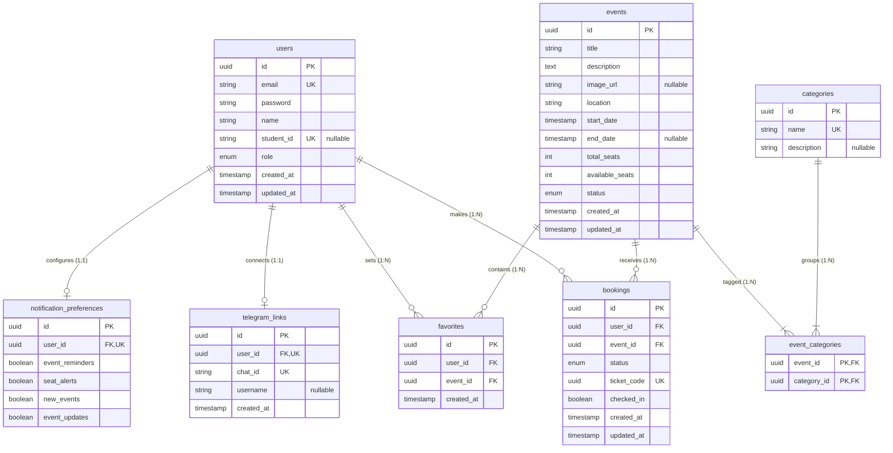

# Minimal ERD and Relational Schema Design

This document details the minimal database requirements, Entity-Relationship Diagram (ERD), and normalized relational schema for the CADT Events platform. It is designed to be straightforward, standard, and free of over-engineering.

---

## 1. Database Requirements

To support the core features (Authentication, Event Discovery, 1-Click Booking, and Telegram Notifications), the database must store and relate six logical entities:

1. **Users**: Identifies students and administrators.
2. **Events**: Details schedule, location, capacity, and current seat vacancy.
3. **Categories**: Groups events (e.g., AI, Web, Soft Skills).
4. **Bookings**: Tracks student registrations, ticket codes, and attendance.
5. **Favorites**: Marks student interests to schedule low-seat warnings.
6. **Telegram Links & Preferences**: Maps web user sessions to Telegram chat channels and toggles alert preferences.

---

## 2. Entity-Relationship Diagram (ERD)

This physical ERD maps entity attributes, keys (Primary/Foreign), and relationship cardinalities using standard Crow's Foot notation.



---

## 3. Relational Schema & Table Definitions

The tables below map the physical schema. Every table is in **Third Normal Form (3NF)**.

### 3.1. `users` Table
Stores authentication details and user system roles.

| Column | Data Type | Constraints | Description |
| :--- | :--- | :--- | :--- |
| `id` | UUID | PRIMARY KEY, Default: `gen_random_uuid()` | Unique user identifier. |
| `email` | VARCHAR(255) | UNIQUE, NOT NULL | Student/Admin email login. |
| `password` | VARCHAR(255) | NOT NULL | Bcrypt hash. |
| `name` | VARCHAR(255) | NOT NULL | Full display name. |
| `student_id` | VARCHAR(50) | UNIQUE, NULLABLE | Official CADT Student ID. |
| `role` | VARCHAR(20) | NOT NULL, Default: `'STUDENT'` | Enums: `'STUDENT'`, `'ADMIN'`. |
| `created_at` | TIMESTAMP | NOT NULL, Default: `CURRENT_TIMESTAMP` | Auditing timestamp. |
| `updated_at` | TIMESTAMP | NOT NULL | Updated automatically. |

### 3.2. `events` Table
Contains details and seat counters for seminars.

| Column | Data Type | Constraints | Description |
| :--- | :--- | :--- | :--- |
| `id` | UUID | PRIMARY KEY, Default: `gen_random_uuid()` | Unique event identifier. |
| `title` | VARCHAR(255) | NOT NULL | Event title. |
| `description` | TEXT | NOT NULL | Rich text markdown summary. |
| `image_url` | VARCHAR(512) | NULLABLE | Cover image CDN link. |
| `location` | VARCHAR(255) | NOT NULL | Room/Hall at venue. |
| `start_date` | TIMESTAMP | NOT NULL | Start time. |
| `end_date` | TIMESTAMP | NULLABLE | End time. |
| `total_seats` | INT | NOT NULL | Total room limit. |
| `available_seats` | INT | NOT NULL | Remaining seats. Cannot be negative. |
| `status` | VARCHAR(20) | NOT NULL, Default: `'DRAFT'` | Enums: `'DRAFT'`, `'PUBLISHED'`, `'CANCELLED'`, `'COMPLETED'`. |
| `created_at` | TIMESTAMP | NOT NULL, Default: `CURRENT_TIMESTAMP` | Audit. |
| `updated_at` | TIMESTAMP | NOT NULL | Audit. |

### 3.3. `categories` Table
Look-up table for grouping filters.

| Column | Data Type | Constraints | Description |
| :--- | :--- | :--- | :--- |
| `id` | UUID | PRIMARY KEY, Default: `gen_random_uuid()` | Category ID. |
| `name` | VARCHAR(100) | UNIQUE, NOT NULL | E.g. `'AI'`, `'Cybersecurity'`, `'Web'`. |
| `description` | VARCHAR(255) | NULLABLE | Short explanation. |

### 3.4. `event_categories` Table
Join table resolving the Many-to-Many ($M:N$) relation between `events` and `categories`.

| Column | Data Type | Constraints | Description |
| :--- | :--- | :--- | :--- |
| `event_id` | UUID | FOREIGN KEY (`events.id`) ON DELETE CASCADE | Parent event link. |
| `category_id` | UUID | FOREIGN KEY (`categories.id`) ON DELETE CASCADE | Target category link. |

* **Composite Primary Key**: `(event_id, category_id)`

### 3.5. `bookings` Table
Tracks reservations and attendance status.

| Column | Data Type | Constraints | Description |
| :--- | :--- | :--- | :--- |
| `id` | UUID | PRIMARY KEY, Default: `gen_random_uuid()` | Booking ID. |
| `user_id` | UUID | FOREIGN KEY (`users.id`) ON DELETE CASCADE | Student booking link. |
| `event_id` | UUID | FOREIGN KEY (`events.id`) ON DELETE CASCADE | Target event link. |
| `status` | VARCHAR(20) | NOT NULL, Default: `'CONFIRMED'` | Enums: `'CONFIRMED'`, `'CANCELLED'`, `'ATTENDED'`. |
| `ticket_code` | UUID | UNIQUE, NOT NULL, Default: `gen_random_uuid()` | Unique QR ticket token. |
| `checked_in` | BOOLEAN | NOT NULL, Default: `FALSE` | Venue entry audit flag. |
| `created_at` | TIMESTAMP | NOT NULL, Default: `CURRENT_TIMESTAMP` | Audit. |
| `updated_at` | TIMESTAMP | NOT NULL | Audit. |

* **Composite Unique Constraint**: `(user_id, event_id)` (Forces a user to have at most 1 reservation per event).

### 3.6. `favorites` Table
Tracks bookmarks for low-capacity reminder notifications.

| Column | Data Type | Constraints | Description |
| :--- | :--- | :--- | :--- |
| `id` | UUID | PRIMARY KEY, Default: `gen_random_uuid()` | Favorite ID. |
| `user_id` | UUID | FOREIGN KEY (`users.id`) ON DELETE CASCADE | Student. |
| `event_id` | UUID | FOREIGN KEY (`events.id`) ON DELETE CASCADE | Bookmarked event. |
| `created_at` | TIMESTAMP | NOT NULL, Default: `CURRENT_TIMESTAMP` | Audit. |

* **Composite Unique Constraint**: `(user_id, event_id)`

### 3.7. `telegram_links` Table
Maps website users to specific Telegram messaging threads.

| Column | Data Type | Constraints | Description |
| :--- | :--- | :--- | :--- |
| `id` | UUID | PRIMARY KEY, Default: `gen_random_uuid()` | Link record ID. |
| `user_id` | UUID | UNIQUE, FOREIGN KEY (`users.id`) ON DELETE CASCADE | Links to at most 1 web user profile. |
| `chat_id` | VARCHAR(100) | UNIQUE, NOT NULL | Target Telegram thread chat ID. |
| `username` | VARCHAR(100) | NULLABLE | Telegram handler username. |
| `created_at` | TIMESTAMP | NOT NULL, Default: `CURRENT_TIMESTAMP` | Audit. |

### 3.8. `notification_preferences` Table
Custom toggles for filtering bot messages.

| Column | Data Type | Constraints | Description |
| :--- | :--- | :--- | :--- |
| `id` | UUID | PRIMARY KEY, Default: `gen_random_uuid()` | Preference record ID. |
| `user_id` | UUID | UNIQUE, FOREIGN KEY (`users.id`) ON DELETE CASCADE | Links to exactly 1 user. |
| `event_reminders` | BOOLEAN | NOT NULL, Default: `TRUE` | Enable 24h/1h event reminders. |
| `seat_alerts` | BOOLEAN | NOT NULL, Default: `TRUE` | Enable low capacity alerts (<20%). |
| `new_events` | BOOLEAN | NOT NULL, Default: `TRUE` | Enable new event alerts in favorite categories. |
| `event_updates` | BOOLEAN | NOT NULL, Default: `TRUE` | Enable schedule change updates. |

---

## 4. Key Performance Indexes

To support rapid filtering and avoid full-table scans, only four high-impact indexes are maintained:

```sql
-- For student event grid search queries filtering status + start date
CREATE INDEX idx_events_search ON events(status, start_date);

-- For listing student active reservations
CREATE INDEX idx_bookings_user ON bookings(user_id);

-- For admin checking venue roster lists
CREATE INDEX idx_bookings_event ON bookings(event_id);

-- For cron workers evaluating low capacity alerts
CREATE INDEX idx_favorites_user ON favorites(user_id);
```
