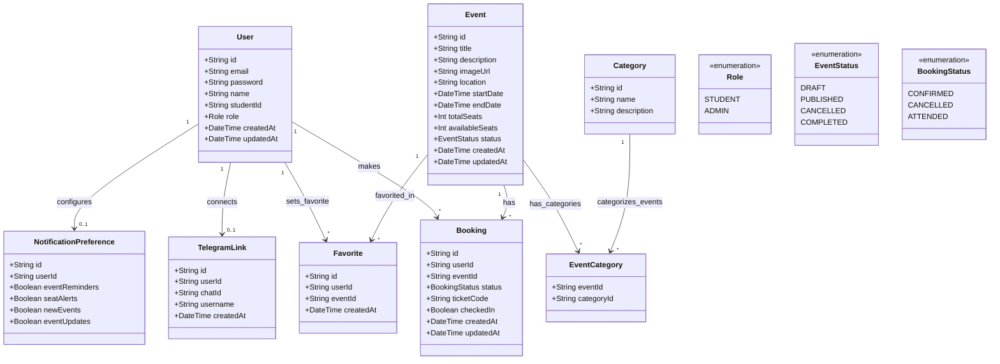
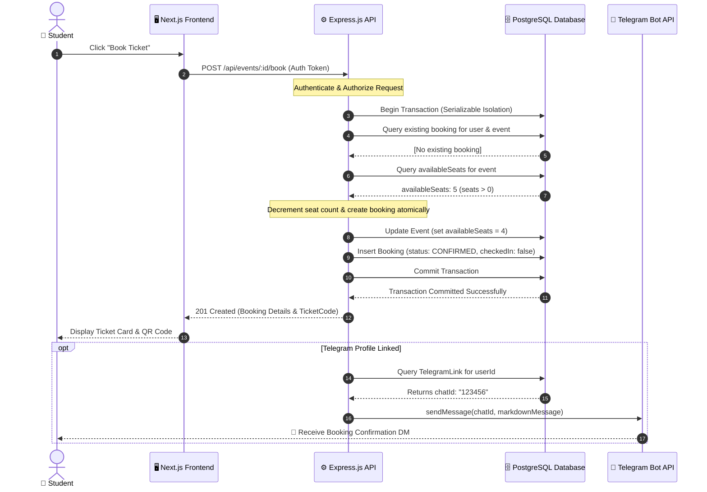
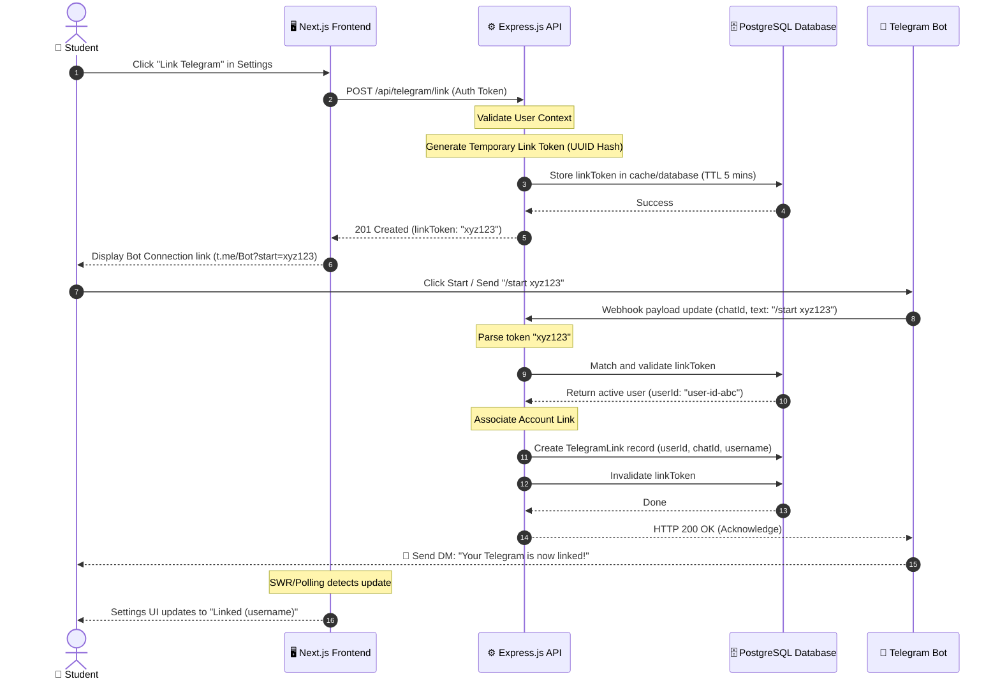
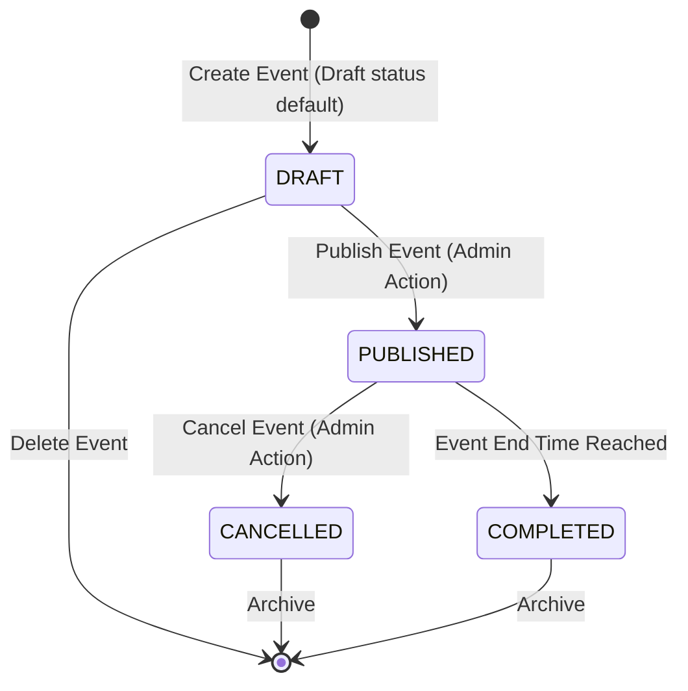
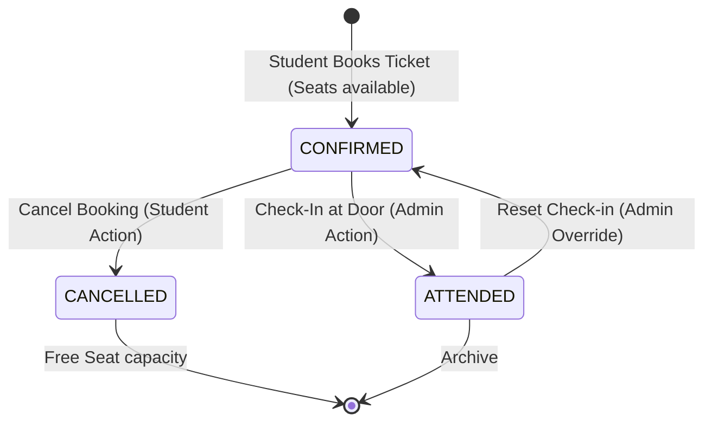
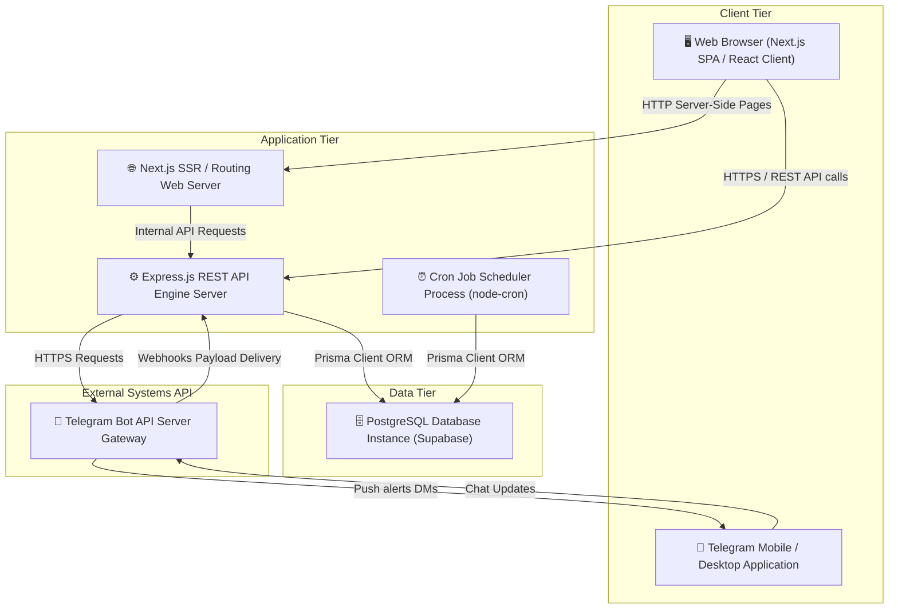

# UML Specifications and Design Diagrams

This document outlines the Unified Modeling Language (UML) structural and behavioral design specifications for the CADT Events platform. These models detail how components interface, how state transitions happen, and how data structures map out.

---

## 1. Domain Class Diagram

The class diagram maps the data models defined in our Prisma configuration and details their properties, datatypes, and multiplicities.

---

## 2. Sequence Diagrams

These behavioral models trace exact network transactions across physical server and network bounds.

### 2.1. Concurrency-Safe 1-Click Ticket Booking
This trace demonstrates database locking protocols during ticket booking execution, protecting the system from race conditions when seats are limited.

### 2.2. Telegram Account Linkage Flow
Demonstrates the secure handoff of verification tokens from web sessions to direct bot messages.

---

## 3. State Diagrams

These diagrams detail the state lifecycles for the central entities of the system.

### 3.1. Event Lifecycle

### 3.2. Booking Ticket Lifecycle

---

## 4. Component / Deployment Diagram

This deployment representation demonstrates the physical tiers and communication protocols binding them together.

