# Use-Case Specifications and Diagram

This document details the system use cases, actor definitions, subsystem boundaries, and step-by-step scenarios for the CADT Events platform. It acts as a bridge between the [Product Requirements Document (PRD)](./prd.md) and the [Database Schema Design](../architecture/database.md).

---

## 1. System Actors

The platform interacts with four distinct actors: two human roles and two automated system agents.

| Actor Icon | Actor Name | Actor Type | Description & Domain Context |
| :--- | :--- | :--- | :--- |
| 👤 | **CADT Student** | Primary (Human) | Enrolled CADT student who discovers upcoming events, books tickets, manages their engagement profile, tracks earned academic credits/badges, and configures personalized Telegram notifications. |
| 💼 | **Academy Administrator** | Primary (Human) | Department coordinators, lecturers, or event organizers who create and manage events, categories, monitor venue booking lists, mark live attendance at the door, and run attendance audits. |
| 🤖 | **Telegram Bot System** | Secondary (System) | The automated messaging worker that handles chat linkage tokens, processes chat commands (`/start`, `/events`, `/bookings`), and broadcasts instant notifications. |
| ⏰ | **Cron Scheduler** | Secondary (System) | An automated background time-based worker that evaluates scheduled jobs, triggers periodic seat alerts, and pre-event reminders. |

---

## 2. High-Level Use-Case Diagram

The diagram below details the system boundary for the **CADT Events Platform**, categorizing use cases into six subsystems:

```mermaid
flowchart LR
    %% Actors
    Student((👤 CADT Student))
    Admin((💼 Academy Admin))
    TelegramBot((🤖 Telegram Bot))
    CronScheduler((⏰ Cron Scheduler))

    %% Styles for Use Cases and Actors
    classDef actor fill:#f5f7fa,stroke:#4a5568,stroke-width:2px;
    classDef usecase fill:#e0f2fe,stroke:#0284c7,stroke-width:1.5px,rx:12,ry:12;
    classDef systemBoundary fill:#f8fafc,stroke:#cbd5e1,stroke-width:2px,stroke-dasharray: 5 5;

    subgraph SystemBoundary ["CADT Events Platform System Boundary"]
        
        subgraph Sub_Auth ["1. Authentication & Profile Subsystem"]
            UC_Register(["UC-01: Register Student Account"])
            UC_Login(["UC-02: Login to Platform"])
            UC_LinkTelegram(["UC-06: Link Telegram Profile"])
            UC_ManageNotif(["UC-07: Manage Notification Preferences"])
        end

        subgraph Sub_Discovery ["2. Discovery & Interaction Subsystem"]
            UC_BrowseEvents(["UC-03: Browse Events Grid"])
            UC_FilterEvents(["UC-03a: Filter & Search Events"])
            UC_FavoriteEvent(["UC-03b: Favorite Event"])
        end

        subgraph Sub_Booking ["3. Booking & Reservation Subsystem"]
            UC_BookTicket(["UC-04: Book Event Ticket (1-Click)"])
            UC_CancelBooking(["UC-05: Cancel Booking"])
            UC_ViewTicket(["UC-04a: View Virtual Ticket & QR"])
            UC_CheckSeats(["Verify Seat Capacity"])
            UC_DeductSeat(["Decrement Seat Count"])
        end

        subgraph Sub_Admin ["4. Admin Control Subsystem"]
            UC_CRUDEvent(["UC-08: Create/Update/Delete Event"])
            UC_ManageCategories(["UC-09: Manage Categories"])
            UC_ViewBookings(["UC-08a: View Event Bookings"])
            UC_CheckIn(["UC-10: Toggle Venue Attendance"])
            UC_ExportData(["UC-11: Export Attendance (CSV/Excel)"])
            UC_BroadcastNotify(["UC-12: Broadcast Event Alert"])
        end

        subgraph Sub_Bot ["5. Telegram Bot Subsystem"]
            UC_BotCommands(["UC-06b: Run Bot Commands (/events, /bookings)"])
            UC_SendAlerts(["UC-06a: Dispatch Push Notifications"])
        end

        subgraph Sub_Cron ["6. Automated Cron Subsystem"]
            UC_RunDailyReminders(["UC-13: Process 24h/1h Reminders"])
            UC_RunSeatAlerts(["UC-14: Process Seat Alerts (<20%)"])
        end
    end

    %% Apply Classes
    class Student,Admin,TelegramBot,CronScheduler actor;
    class UC_Register,UC_Login,UC_LinkTelegram,UC_ManageNotif,UC_BrowseEvents,UC_FilterEvents,UC_FavoriteEvent,UC_BookTicket,UC_CancelBooking,UC_ViewTicket,UC_CheckSeats,UC_DeductSeat,UC_CRUDEvent,UC_ManageCategories,UC_ViewBookings,UC_CheckIn,UC_ExportData,UC_BroadcastNotify,UC_BotCommands,UC_SendAlerts,UC_RunDailyReminders,UC_RunSeatAlerts usecase;

    %% Student Connections
    Student --> UC_Register
    Student --> UC_Login
    Student --> UC_LinkTelegram
    Student --> UC_ManageNotif
    Student --> UC_BrowseEvents
    Student --> UC_FilterEvents
    Student --> UC_FavoriteEvent
    Student --> UC_BookTicket
    Student --> UC_CancelBooking
    Student --> UC_ViewTicket
    Student --> UC_BotCommands

    %% Admin Connections
    Admin --> UC_Login
    Admin --> UC_CRUDEvent
    Admin --> UC_ManageCategories
    Admin --> UC_ViewBookings
    Admin --> UC_CheckIn
    Admin --> UC_ExportData
    Admin --> UC_BroadcastNotify

    %% Bot Connections
    TelegramBot --> UC_LinkTelegram
    TelegramBot --> UC_BotCommands
    TelegramBot --> UC_SendAlerts

    %% Cron Connections
    CronScheduler --> UC_RunDailyReminders
    CronScheduler --> UC_RunSeatAlerts

    %% Relationships (Includes / Extends)
    UC_BookTicket -.->|include| UC_Login
    UC_BookTicket -.->|include| UC_CheckSeats
    UC_BookTicket -.->|include| UC_DeductSeat
    UC_BookTicket -.->|extend| UC_SendAlerts
    
    UC_CancelBooking -.->|include| UC_Login
    UC_CancelBooking -.->|extend| UC_SendAlerts

    UC_LinkTelegram -.->|include| UC_Login

    UC_FavoriteEvent -.->|include| UC_Login

    UC_RunDailyReminders -.->|include| UC_SendAlerts
    UC_RunSeatAlerts -.->|include| UC_SendAlerts
    UC_BroadcastNotify -.->|include| UC_SendAlerts
    UC_CRUDEvent -.->|extend| UC_SendAlerts
```



---

## 3. Subsystem Breakdown & Detailed Specifications

### Subsystem 1: Authentication & Profile Subsystem

#### UC-01: Register Student Account
* **Primary Actor:** CADT Student
* **Description:** Allows a guest student to create a personal profile on the CADT Events website.
* **Preconditions:** Guest has access to the web portal and is not currently authenticated.
* **Postconditions:** A new `User` record is created in the database with role set to `STUDENT`, and an auth token is generated.
* **Main Flow:**
  1. Student navigates to the `/register` page.
  2. Student enters Name, Email (must match `@cadt.edu.kh` format), Password (min 8 chars), and Student ID.
  3. Student submits the form.
  4. System validates inputs via Zod schema (boundary validation).
  5. System hashes password with bcrypt.
  6. System saves record to database `User` table.
  7. System generates JWT Access and Refresh tokens and returns them to the frontend.
  8. Frontend saves tokens, updates the context auth state, and redirects the student to the home page.
* **Alternative Flows:**
  * **[Alt 1] Email Already Registered:** System throws a 409 Conflict Error. Frontend displays "Email already in use."
  * **[Alt 2] Student ID Already Bound:** System throws a 409 Conflict Error. Frontend alerts user.
  * **[Alt 3] Invalid Format:** Form validation fails (e.g. non-academic email). Frontend rejects submission before sending to API.

#### UC-02: Login to Platform
* **Primary Actor:** CADT Student, Academy Administrator
* **Description:** Authenticates users and establishes session tokens.
* **Preconditions:** User has a registered account.
* **Postconditions:** JWT session tokens generated; user is redirected based on their role.
* **Main Flow:**
  1. User opens `/login` page.
  2. User inputs registered Email and Password.
  3. System checks credentials against database records.
  4. System matches hashed password.
  5. System returns Access Token and Refresh Token.
  6. Frontend handles role navigation:
     * If role is `ADMIN` → Redirect to `/admin`.
     * If role is `STUDENT` → Redirect to `/dashboard`.
* **Alternative Flows:**
  * **[Alt 1] Invalid Credentials:** Database validation fails. System throws `401 UnauthorizedError`. Frontend displays "Invalid email or password".

---

### Subsystem 2: Discovery & Interaction Subsystem

#### UC-03: Browse Events Grid
* **Primary Actor:** CADT Student
* **Description:** Students search, filter, and view details of published events.
* **Preconditions:** None (Public access allowed for browsing).
* **Postconditions:** None.
* **Main Flow:**
  1. Student visits `/` (Home page).
  2. Frontend requests active list from `/api/events?upcoming=true`.
  3. Backend queries database `Event` table filtered by `status: "PUBLISHED"`.
  4. Frontend displays event cards indicating available seats, title, description, category, and date.
* **Alternative Flows:**
  * **[Alt 1] Event is in DRAFT status:** Backend ignores drafts in public queries. Public users cannot view drafts.

#### UC-03a: Filter & Search Events
* **Primary Actor:** CADT Student
* **Description:** Limits the list of displayed events matching filters.
* **Preconditions:** None.
* **Main Flow:**
  1. User inputs a text search or selects a specific category tag (e.g., "AI", "Soft Skills") in the sidebar.
  2. Frontend sends request to GET `/api/events?search=text&category=tag`.
  3. Backend executes search filtering in Prisma (`contains` query on event details).
  4. Frontend updates the grid dynamically.

#### UC-03b: Favorite Event
* **Primary Actor:** CADT Student
* **Description:** Saves an event in the student's dashboard favorites list, automatically scheduling seat alerts.
* **Preconditions:** Student is logged in.
* **Postconditions:** A new `Favorite` record is created in the database.
* **Main Flow:**
  1. Student clicks the favorite "Heart" icon on `/events/[id]`.
  2. Frontend fires POST `/api/events/:id/favorite`.
  3. Backend creates a `Favorite` connection linked to the user's `userId` and `eventId`.
  4. System confirms addition.

---

### Subsystem 3: Booking & Reservation Subsystem

#### UC-04: Book Event Ticket (1-Click)
* **Primary Actor:** CADT Student
* **Description:** Reservability check followed by atomic ticket allocation.
* **Preconditions:** Student is authenticated; event status is `PUBLISHED`.
* **Postconditions:** Seat capacity decremented by 1; `Booking` table records the registration; Ticket code is generated.
* **Main Flow:**
  1. Student clicks "Book Ticket" on the event details page.
  2. System processes POST `/api/events/:id/book` wrapped in a database transaction.
  3. System verifies seat availability: `availableSeats > 0`.
  4. System checks if student has already booked this event.
  5. System decrements `availableSeats` in the `Event` model.
  6. System inserts booking row with `BookingStatus.CONFIRMED` and unique `ticketCode`.
  7. Transaction commits.
  8. System sends instant booking confirmation card through Telegram Bot (if user linked their account).
  9. Frontend displays ticket receipt.
* **Alternative Flows (Concurrency & Cap checks):**
  * **[Alt 1] Double-Booking Attempt:** Student already has a confirmed booking. Transaction rolls back, system returns `409 Conflict` (Already booked).
  * **[Alt 2] Race-Condition (Seats Sold Out):** Two users submit concurrently but only 1 seat remains. The database transaction handles atomic decrements. The second user's execution fails the capacity guard (`availableSeats === 0`). System rolls back transaction and throws `409 Conflict` ("No seats available").

#### UC-05: Cancel Booking
* **Primary Actor:** CADT Student
* **Description:** Frees up seats and updates user status.
* **Preconditions:** Student has a confirmed booking for the event.
* **Postconditions:** `availableSeats` incremented by 1; booking row status set to `CANCELLED`.
* **Main Flow:**
  1. Student clicks "Cancel Booking" under `/dashboard/bookings`.
  2. System processes DELETE `/api/bookings/:id` in a database transaction.
  3. System updates `Booking` status to `CANCELLED`.
  4. System increments `availableSeats` by 1.
  5. Transaction commits.
  6. Telegram bot updates user: "Your registration for [Event] has been cancelled."
  7. Page reloads.

---

### Subsystem 4: Admin Control Subsystem

#### UC-08: Create/Update/Delete Event
* **Primary Actor:** Academy Administrator
* **Description:** Full admin lifecycle management of event records.
* **Preconditions:** Administrator is logged in and authenticated via `Role.ADMIN` token metadata.
* **Postconditions:** Database `Event` table is modified.
* **Main Flow:**
  1. Admin opens `/admin/events/new` form.
  2. Admin populates fields: Title, Description, Location, Start/End Dates, Total Seats, and Category list.
  3. Admin selects Initial Status (`DRAFT` or `PUBLISHED`).
  4. Admin clicks "Save".
  5. System creates database record. If published, it triggers category broadcast notifications to users who selected notifications for those categories.
* **Alternative Flows:**
  * **[Alt 1] Unauthorized access:** Non-admin attempts to POST to `/api/admin/events`. Middleware checks JWT role. Reject request immediately with `403 ForbiddenError`.

#### UC-10: Toggle Venue Attendance (Check-in/out)
* **Primary Actor:** Academy Administrator
* **Description:** On-site ticket verification process at the venue door.
* **Preconditions:** Admin is logged in.
* **Postconditions:** User booking `checkedIn` toggled; booking status changed to `ATTENDED`.
* **Main Flow:**
  1. Admin accesses `/admin/events/[id]/bookings` table.
  2. Search bar allows locating student by ID or Name.
  3. Admin clicks "Mark Checked-In" next to student's record.
  4. Backend triggers POST `/api/admin/bookings/:id/checkin` or updates state.
  5. System updates `checkedIn: true` and `status: ATTENDED`.
  6. UI reflects checked-in status in real time.
* **Alternative Flows:**
  * **[Alt 1] Reverse Check-in:** Student checked in by mistake. Admin clicks "Mark Checked-Out". System resets status back to `CONFIRMED` and `checkedIn: false`.

#### UC-11: Export Attendance (CSV/Excel)
* **Primary Actor:** Academy Administrator
* **Description:** Downloadable report of attendees for records and audits.
* **Preconditions:** Admin is authenticated.
* **Main Flow:**
  1. Admin navigates to `/admin/events/[id]/bookings`.
  2. Admin clicks "Export to CSV".
  3. Frontend requests export data or processes table data.
  4. File containing Student Name, Email, Student ID, Major, Check-in Time, and Attendance status is compiled and downloaded.

---

### Subsystem 5: Telegram Bot Subsystem

#### UC-06: Link Telegram Profile
* **Primary Actor:** CADT Student, Telegram Bot System
* **Description:** Secure linkage of web user accounts with chat IDs.
* **Preconditions:** Student is logged in on the web platform.
* **Postconditions:** `TelegramLink` table maps `userId` to `chatId` in database.
* **Main Flow:**
  1. Student clicks "Connect Telegram" on `/dashboard/settings`.
  2. Web platform calls POST `/api/telegram/link`, returning a short-lived link token.
  3. Web UI instructs student to click the deep link: `https://t.me/CADTEventsBot?start=token_hash`.
  4. Bot opens on Telegram. Student clicks "Start".
  5. Telegram Bot receives chat update with the deep-linked token.
  6. Bot calls backend `/api/telegram/webhook` or handles internally.
  7. System locates matching user profile, saves `chatId` and `username` in `TelegramLink` table, and marks connection as complete.
  8. Bot sends verification: "Your Telegram is now linked to CADT Events!"

#### UC-06b: Run Bot Commands
* **Primary Actor:** CADT Student, Telegram Bot System
* **Description:** Interacting with the bot using chat commands.
* **Preconditions:** Telegram account linked (for personal query commands).
* **Main Flow:**
  1. Student enters a command in chat:
     * `/events` → Bot queries database for published upcoming events and returns a rich list.
     * `/bookings` → Bot fetches active bookings linked to that `chatId`'s `userId`.
     * `/unsubscribe` → Bot toggles user notification preferences off.
  2. Bot responds with markdown-formatted message cards.

---

### Subsystem 6: Automated Cron Subsystem

#### UC-13: Process 24h/1h Reminders
* **Primary Actor:** Cron Scheduler, Telegram Bot System
* **Description:** Periodic scans to push pre-event alerts.
* **Preconditions:** User has booking, has not unsubscribed from alerts, and event starts within 24h or 1h.
* **Postconditions:** Notification sent; alert logged.
* **Main Flow:**
  1. Cron worker triggers hourly script.
  2. Script queries all active `CONFIRMED` bookings where the parent `Event` starts between `T+23h` and `T+24h` (or `T+1h`).
  3. For each match, script checks if the user has `eventReminders: true` in `NotificationPreference`.
  4. Script invokes `sendNotification(userId, msg)` via Telegram service.
  5. Bot delivers reminder.

#### UC-14: Process Seat Alerts
* **Primary Actor:** Cron Scheduler, Telegram Bot System
* **Description:** Warns favoriters that an event is booking up fast.
* **Preconditions:** Active seats drop below 20% of `totalSeats` and `seatAlerts: true`.
* **Main Flow:**
  1. Cron script queries published events.
  2. Evaluates capacity ratio: `availableSeats / totalSeats <= 0.2`.
  3. Identifies users who have favorited this event (`Favorite` model) but have not booked yet.
  4. Sends targeted Telegram DM warning: "Only X seats left! Book now."

---

## 4. Key Precedence & Business Rule Constraints

1. **Prerequisite Chains:**
   ```
   [Register] ──► [Login] ──► [Link Telegram] ──► [Receive Segmented Alert]
                              [Book Ticket]   ──► [Mark Checked-in / Attended]
   ```

2. **Concurrency Safe Booking Flow:**
   ```
   Student clicks Book Ticket
        │
        ▼
   Open Prisma Transaction (Serializable/Read Committed with lock)
        │
        ├──► check: User already booked? ──► YES ──► Abort & Rollback (409 Conflict)
        │
        ├──► check: availableSeats > 0?  ──► NO  ──► Abort & Rollback (409 Conflict)
        │
        ▼
   Update Event: set availableSeats = availableSeats - 1
        │
        ▼
   Insert Booking: status = CONFIRMED, ticketCode = UUID()
        │
        ▼
   Commit Transaction ──► Send Telegram Confirmation (Async Event Dispatch)
   ```

3. **Status Transitions:**
   - Event: `DRAFT` ──► `PUBLISHED` ──► `COMPLETED` or `CANCELLED`
   - Booking: `CONFIRMED` ──► `ATTENDED` (on check-in) or `CANCELLED` (on cancellation)
