# Software Engineering Report — CADT Events

| Field | Value |
|---|---|
| **Course / Module** | Software Engineering (SE) |
| **Project** | CADT Events Platform |
| **Focus (assessment)** | UML: Use Case · Activity · Sequence · Class |
| **Date** | 2026-07-13 |
| **Version** | 1.1 (every feature fully written + UML F1–F17) |
| **Team** | _[Names / Student IDs]_ |

> **Primary UML sections:** §4 Use Cases · §5 Activity · §6 Sequence · §7 Class  
> **Code truth:** `backend/src/modules/*`, `backend/prisma/schema.prisma`  
> **Related:** [`../architecture/software-engineering/use-cases.md`](../architecture/software-engineering/use-cases.md), [`../product/prd.md`](../product/prd.md), [`5-backend-report.md`](./5-backend-report.md)

---

## 1. Introduction

### 1.1 Introduction to the project

**CADT Events** is a campus event management platform for the **Cambodia Academy of Digital Technology (CADT)**. It replaces fragmented Telegram announcements and manual registration with:

| Component | Responsibility |
|---|---|
| Student web (`frontend/`) | Discover events, book seats, favorites, Telegram link |
| Admin web (`frontend-admin/`) | Create/publish events, manage registrations, check-in |
| Backend API (`backend/`) | REST API, authZ, business rules, integrations |
| PostgreSQL (Supabase) | Persistent data via Prisma |

Identity is provided by **Clerk** (sign-in / JWT). The API verifies Bearer tokens and enforces **ADMIN** vs student access. Optional **Telegram** delivers registration and publish notifications; **Cloudinary** stores cover images.

### 1.2 Objectives of this report

1. Introduce the project and SE context.  
2. Identify **actors** and **functional features**.  
3. Provide **use case diagrams** — overview **and separate detailed diagrams per feature**.  
4. Provide **activity diagrams** at the same feature granularity.  
5. Provide **sequence diagrams** for critical interactions (student, admin, systems).  
6. Provide a **domain class diagram** matching the Prisma data model and key API layers.  
7. Link diagrams to implementation so the design is traceable to code.

### 1.3 What this report emphasizes (teacher focus)

| UML artifact | Teacher expectation | How this report delivers it |
|---|---|---|
| **Use case** | Actors, system boundary, include/extend, **one diagram per major feature** | §4 |
| **Activity** | Workflow, decisions, swimlanes where useful | §5 |
| **Sequence** | Objects/lifelines, messages, alt/opt fragments | §6 |
| **Class** | Attributes, associations, multiplicities | §7 |

### 1.4 Scope

| In scope | Out of scope |
|---|---|
| UML for implemented features | Full project-management thesis |
| Actors: Student, Admin, Clerk, Telegram Bot, Cron | Native mobile app design |
| Behavioral + structural design | Pixel-level UI design (see HCI report) |

---

## 2. Actors & system context

### 2.1 Actors

| Actor | Type | Description |
|---|---|---|
| **Student** | Primary human | CADT student; browses, books, favorites, links Telegram |
| **Admin** | Primary human | Organizer/teacher; CRUD events, check-in, users, settings |
| **Clerk** | External system | Authentication & user identity (JWT, invitations, webhooks) |
| **Telegram Bot** | External system | Deep-link connect; send registration/publish/reminder messages |
| **Cron Scheduler** | System | Runs reminder jobs (`node-cron`) |
| **Cloudinary** | External system | Stores uploaded event cover images |

### 2.2 Context diagram

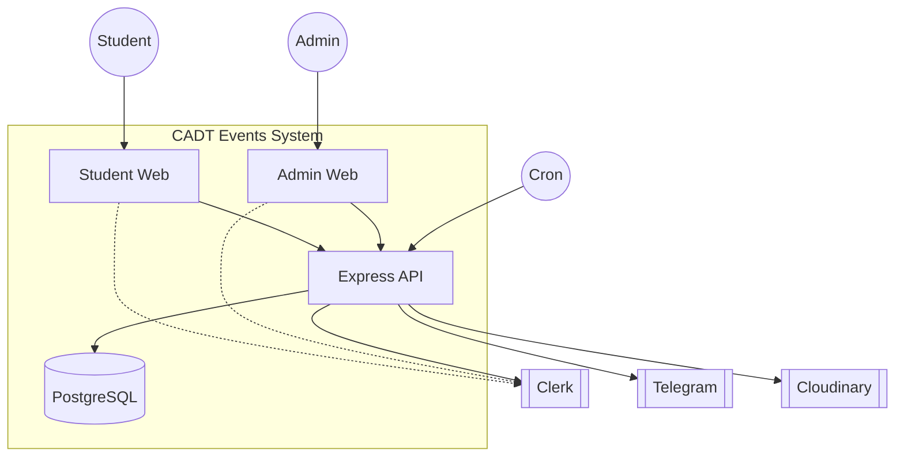

---

## 3. Feature inventory

Diagrams and written specs are **separated by feature**. Every implemented backend capability is listed.

| ID | Feature | Primary actor(s) | Key API / entry |
|---|---|---|---|
| F1 | Authenticate (sign-in / session / role) | Student, Admin, Clerk | Clerk JWT → `requireAuth` / `requireRole` |
| F2 | Browse & view events (+ seats) | Student | `GET /api/events`, `/:id`, `/:id/seats` |
| F3 | Favorite event | Student | `GET/POST /api/favorites/*` |
| F4 | Book event (register) | Student | `POST /api/bookings` |
| F5 | Cancel booking | Student | `DELETE /api/bookings/:id` |
| F6 | View my bookings | Student | `GET /api/bookings/me` |
| F7 | Link / status / disconnect Telegram | Student, Telegram Bot | `/api/telegram/*` + bot `/start` |
| F8 | Create / update / publish event (+ admin list all) | Admin | `POST/PATCH /api/events`, `GET /api/events/all` |
| F9 | Soft-delete event | Admin | `DELETE /api/events/:id` |
| F10 | View event registrations | Admin | `GET /api/bookings/event/:eventId` |
| F11 | Check-in attendee | Admin | `PATCH /api/bookings/:id/checkin` |
| F12 | Upload event image | Admin, Cloudinary | `POST /api/upload` |
| F13 | List users, invite, system settings | Admin, Clerk | `/api/users`, `/invite`, `/settings` |
| F14 | User sync webhook | Clerk | `POST /api/webhooks` |
| F15 | Event reminder (cron) | Cron, Telegram | `telegram.cron` + `event_reminder` |
| F16 | In-app notifications (student + admin feed) | Student, Admin | `/api/notifications/*` |
| F17 | Health check (ops) | Operator / platform | `GET /api/health` |

---

## 3A. Complete written specifications (every feature in full)

> This section is the **full textual SE specification** for each feature: goal, actors, pre/post conditions, main flow, alternatives, exceptions, business rules, I/O, data, security, UI, and code location. Diagrams in §4–§7 illustrate the same features.

---

### F1 — Authenticate (sign-in, session, API authorization)

| Item | Full detail |
|---|---|
| **Name / ID** | F1 — Authenticate |
| **Goal** | Establish a trusted identity so the API can authorize student or admin actions. |
| **Primary actors** | Student, Admin |
| **Secondary actors** | Clerk (IdP) |
| **Priority** | Must-have (blocks almost all write paths) |
| **Trigger** | User opens SPA and signs in; or SPA sends API request with Bearer token |
| **Preconditions** | Clerk project configured (`CLERK_*` keys); user has Clerk account or invitation |
| **Postconditions** | SPA holds valid session/JWT; API can resolve `userId`; admin routes can resolve ADMIN role |
| **Related data** | No password stored in app logic; `user_account.password_hash = 'managed-by-clerk'`; Clerk `publicMetadata.role` |
| **Security** | TLS in production; Bearer JWT; never log full secrets |

**Main success scenario**

1. User opens Student SPA or Admin SPA.  
2. Clerk hosted/embedded UI collects credentials (or SSO as configured in Clerk).  
3. Clerk validates identity and returns a session / JWT to the SPA.  
4. SPA stores session via Clerk SDK.  
5. On each API call, SPA sends `Authorization: Bearer <token>`.  
6. API `requireAuth` extracts token, calls `verifyToken` with `CLERK_SECRET_KEY`.  
7. On success, attaches `customAuth.userId = verified.sub`.  
8. If route uses `requireRole('ADMIN')`, API loads Clerk user, reads `publicMetadata.role` and/or checks `ADMIN_EMAILS` allowlist.  
9. If allowlisted email lacks ADMIN role, middleware may **heal** metadata to `ADMIN`.  
10. Request continues to controller.

**Alternative flows**

- **A1 — Admin by allowlist only:** role metadata missing but email in `ADMIN_EMAILS` → treated as admin; metadata heal attempted.  
- **A2 — Student calling student routes:** role may be STUDENT or empty; admin-only routes blocked.

**Exceptions**

| Code | Condition | System response |
|---|---|---|
| 401 | No `Authorization` header / not Bearer | `{ success:false, message: Missing… }` |
| 401 | Invalid invalid/expired | Unauthenticated message |
| 403 | Authenticated but not admin on admin route | `ForbiddenError` |
| Boot fail | Missing Clerk env | Process exits via env Zod |

**Include / extend**

- «included by» almost all F3–F13, F16 student/admin APIs.  
- Works with **F14** (webhook) so DB user rows exist after sign-up.

**UI**

- Student: Clerk sign-in on `frontend/`.  
- Admin: Clerk sign-in on `frontend-admin/`.

**Source files**

- `backend/src/common/middleware/auth.middleware.ts`  
- `backend/src/config/admins.ts`  
- `backend/src/app.ts` (`clerkMiddleware`)  
- SPA Clerk providers (frontend packages)

**Diagrams:** Use case §4.2 · Activity §5.1 · Sequence (embedded in protected flows §6)

---

### F2 — Browse & view events (list, search, detail, seats)

| Item | Full detail |
|---|---|
| **Name / ID** | F2 — Browse & view events |
| **Goal** | Let students discover campus events and open details before booking. |
| **Primary actor** | Student (list/detail public; seats require auth) |
| **Priority** | Must-have |
| **Trigger** | Open Events page or event detail / seat map |
| **Preconditions** | API reachable; events may exist with `deleted_at = null` |
| **Postconditions** | Student sees event cards/detail; optional seat occupancy snapshot |

**Main success scenario — list**

1. Student opens Events page.  
2. SPA calls `GET /api/events`.  
3. API queries events where `deleted_at` is null and status ∈ `{published, ongoing, completed}` by default (so history appears on calendars).  
4. Optional query: `search` (title/description contains, case-insensitive), `featured=true`, or explicit `status`.  
5. Includes venue name, registration count, questions ordered by `order_index`.  
6. Maps to camelCase DTO (`id`, `title`, `availableSeats`, …).  
7. SPA renders grid/list.

**Main success scenario — detail**

1. Student opens an event.  
2. `GET /api/events/:id`.  
3. If not found / soft-deleted → 404.  
4. Return full detail + registration questions for booking form.

**Main success scenario — seats**

1. Authenticated student opens seat map.  
2. `GET /api/events/:id/seats` with JWT.  
3. API loads event + all active registrations’ `seat_label`.  
4. Returns `occupiedSeats[]`, `totalBookings`, `capacity`, `availableSeats`, `venueName`.

**Business rules**

- Soft-deleted events never appear.  
- Public list does **not** include `draft` unless filtered differently; admin uses F8 `GET /api/events/all`.  
- `availableSeats = max(0, capacity - registrationCount)` when capacity set; else null.

**Exceptions:** 404 event not found; 401 on seats without token.

**API**

| Method | Path | Auth | Query / notes |
|---|---|---|---|
| GET | `/api/events` | Public | `search`, `featured`, `status` |
| GET | `/api/events/:id` | Public | |
| GET | `/api/events/:id/seats` | Auth | |

**Data:** `Event`, `Venue`, `EventQuestion`, `Registration` (counts/labels)

**Source:** `events.routes.ts`, `events.controller.ts` (`listEvents`, `getEvent`, `getEventSeats`)

**Diagrams:** §4.3 · §5.2 · §6.2

---

### F3 — Favorite event

| Item | Full detail |
|---|---|
| **Name / ID** | F3 — Favorite event |
| **Goal** | Bookmark events for quick access. |
| **Actor** | Student |
| **Trigger** | Click favorite/heart on event |
| **Preconditions** | Authenticated; event exists |
| **Postconditions** | Favorite row created or removed; UI icon updates |

**Main flow**

1. Student authenticated.  
2. SPA `POST /api/favorites/toggle` with `{ eventId }`.  
3. API ensures `user_account` exists (lazy-create from Clerk if missing).  
4. Load event; 404 if missing.  
5. If unique `(user_id, event_id)` exists → delete → `{ action: 'removed' }`.  
6. Else create `favorite` with new UUID → `{ action: 'added' }`.  

**List flow:** `GET /api/favorites/me` returns favorites with nested event summary; empty array if user not in DB yet.

**Business rules**

- Unique constraint `unique_user_bookmark` on `(user_id, event_id)`.  
- Toggle is idempotent in UX terms (second click undoes).

**Exceptions:** 401 unauthenticated; 400 missing `eventId`; 404 event/user create failure.

**Data:** `Favorite`, `UserAccount`, `Event`

**Source:** `favorites.controller.ts`, `favorites.routes.ts`

**Diagrams:** §4.4 · §5.3 · §6.3

---

### F4 — Book event (register)

| Item | Full detail |
|---|---|
| **Name / ID** | F4 — Book event |
| **Goal** | Reserve a place (optional labeled seat) on a published event with optional form answers. |
| **Actor** | Student; Telegram (extend) |
| **Trigger** | Click Register / Book on event detail |
| **Preconditions** | Valid JWT; event `status = published`, `deleted_at = null` |
| **Postconditions** | `Registration` created; optional `RegistrationAnswer` rows; booking reference issued; optional Telegram DM |

**Request body (Zod `CreateBookingSchema`)**

| Field | Rules |
|---|---|
| `eventId` | UUID required |
| `seatLabel` | Optional; regex `^[A-Za-z][0-9]{1,2}$`; uppercased (e.g. A1, B10) |
| `answers` | Optional map `questionId → string` |

**Main success scenario**

1. Student submits booking from SPA.  
2. `POST /api/bookings` + JWT + validated body.  
3. Resolve `userId`; load or **lazy-create** `user_account` from Clerk profile.  
4. Begin **Prisma transaction**.  
5. Load event: must be published, not deleted; include questions.  
6. For each `is_required` question, ensure `answers[question_id]` present → else 400.  
7. Count active registrations (`deleted_at` null); if `capacity` set and count ≥ capacity → 409.  
8. If user already has active registration for event → 409.  
9. If `seatLabel` provided and another active reg has same label → 409.  
10. Generate `registration_id` (UUID) and `booking_reference` = `CADT-YYYYMMDD-XXXX`.  
11. Insert `registration` (optional `seat_label`).  
12. If answers present, `createMany` `registration_answer`.  
13. Commit transaction.  
14. Map response DTO (`status: 'CONFIRMED'`, event summary, `qrCodeToken` fallback to reference).  
15. Return **201**.  
16. **Extend:** async `notifyUserViaTelegram` with HTML message, optional cover image, button to public `/my-booking` (HTTPS only).

**Exceptions**

| HTTP | Condition |
|---|---|
| 401 | No/invalid auth |
| 400 | Missing answers for required questions; bad seat format (Zod); user not authenticated |
| 404 | Event not found/not published; user create failed |
| 409 | Capacity full; already booked; seat taken |

**Business rules**

- One active booking per user per event.  
- Capacity is application-enforced inside a transaction (not serializable isolation guarantee under extreme concurrency).  
- Past-event booking not explicitly blocked if still `published` (product may allow); cancel is blocked if started (F5).  
- Telegram failure must not fail HTTP response.

**Data:** `Registration`, `RegistrationAnswer`, `Event`, `EventQuestion`, `UserAccount`

**Source:** `bookings.controller.ts` (`createBooking`), `common/schemas`, `telegram.service.ts`

**Diagrams:** §4.5 · §5.4 · §6.1

---

### F5 — Cancel booking

| Item | Full detail |
|---|---|
| **Name / ID** | F5 — Cancel booking |
| **Goal** | Student frees their seat/registration before the event starts. |
| **Actor** | Student; Telegram (extend) |
| **Trigger** | Cancel action on My Bookings |
| **Preconditions** | Auth; booking belongs to user; `deleted_at` null |
| **Postconditions** | Soft-deleted registration; capacity slot free for others; optional Telegram cancel message |

**Main flow**

1. `DELETE /api/bookings/:id` with JWT.  
2. Load user; load registration where `registration_id = id` AND `user_id` AND not deleted.  
3. If missing → 404.  
4. If `event.start_time < now` → 400 “Cannot cancel a booking for a past event”.  
5. Set `deleted_at = now` (soft delete).  
6. Return success message.  
7. Async Telegram: registration cancelled for event title.

**Business rules**

- Soft delete preserves row for audit; counts for capacity use `deleted_at: null`.  
- Only owner can cancel (admin cancel-not-via-this-endpoint).

**Data:** `Registration`, `Event`, `UserAccount`

**Source:** `cancelBooking` in `bookings.controller.ts`

**Diagrams:** §4.6 · §5.5 · §6.4

---

### F6 — View my bookings

| Item | Full detail |
|---|---|
| **Name / ID** | F6 — View my bookings |
| **Goal** | Show the student all active registrations with event summary (ticket-like list). |
| **Actor** | Student |
| **Trigger** | Open My Bookings / My registrations page |
| **Preconditions** | Authenticated; user row preferably exists |
| **Postconditions** | Read-only list displayed |

**Main flow**

1. `GET /api/bookings/me` + JWT.  
2. Find `user_account` by Clerk id → 404 if missing.  
3. `findMany` registrations where `user_id` and `deleted_at` null, order `created_at` desc.  
4. Include event fields: title, times, cover, type, status, badge, credit_value, venue name.  
5. Normalize each to SPA shape (`bookingReferenceId`, `qrCodeToken`, `status: CONFIRMED`, …).  
6. SPA renders cards/tickets.

**Exceptions:** 401; 404 user not found (user may need to book once or wait for webhook F14).

**Data:** `Registration`, `Event`, `Venue`

**Source:** `getMyBookings`

**Diagrams:** §4.7 · §5.6 · §6.12 (sequence)

---

### F7 — Link / status / disconnect Telegram

| Item | Full detail |
|---|---|
| **Name / ID** | F7 — Telegram account linking |
| **Goal** | Bind Telegram `chat_id` to CADT user for DMs (booking, publish, reminders). |
| **Actors** | Student, Telegram Bot |
| **Preconditions** | Auth for HTTP APIs; `TELEGRAM_BOT_TOKEN` for bot features |
| **Postconditions** | `user_account.telegram_chat_id` set or cleared; Clerk metadata may mirror chat id |

**Sub-flows**

**F7a — Get connect link**

1. `GET /api/telegram/connect` + JWT.  
2. If bot not configured → return `deepLink: null` + message.  
3. Else `deepLink = https://t.me/{botUsername}?start={userId}`.

**F7b — Bot link**

1. User opens deep link; Telegram sends `/start <userId>`.  
2. Bot finds `user_account` by `user_id` or creates from Clerk.  
3. Updates `telegram_chat_id = chatId`.  
4. Updates Clerk `publicMetadata.telegram_chat_id`.  
5. Sends welcome message in Telegram.

**F7c — Status**

1. `GET /api/telegram/status` → `{ configured: boolean, isConnected: boolean }` based on bot presence and non-null chat id.

**F7d — Disconnect**

1. `DELETE /api/telegram/disconnect`.  
2. `updateMany` set `telegram_chat_id = null`.  
3. Clear Clerk metadata field.  
4. Success message.

**Business rules**

- Inline Telegram URL buttons require **https** public web base (`PUBLIC_WEB_URL` / production web).  
- `/start` without payload shows help text only.  
- Bot uses long polling when token set (`initTelegramBot` on server start).

**Exceptions:** 401; bot disabled degrades gracefully.

**Data:** `UserAccount.telegram_chat_id`

**Source:** `telegram.controller.ts`, `telegram.service.ts`, `telegram.routes.ts`

**Diagrams:** §4.8 · §5.7 · §6.5

---

### F8 — Create / update / publish event (+ admin list all)

| Item | Full detail |
|---|---|
| **Name / ID** | F8 — Admin event management |
| **Goal** | Organizers create and maintain the event catalog, including draft/publish, questions, reminders. |
| **Actor** | Admin |
| **Preconditions** | `requireAuth` + `requireRole('ADMIN')` |
| **Postconditions** | Event row created/updated; optional questions/reminders; Telegram broadcast on publish |

**F8a — List all events (admin)**

- `GET /api/events/all` — all non-deleted events including drafts; optional `search`; order by `created_at` desc.

**F8b — Create event**

**Body (Zod `CreateEventSchema`)**

| Field | Validation |
|---|---|
| `title` | min 3 chars |
| `description` | min 10 chars |
| `startTimestamp`, `endTimestamp` | required strings → Date; end > start |
| `location` | min 2 chars |
| `capacity` | optional positive int |
| `coverImageUrl` | optional URL or `''` |
| `eventType` | optional string; mapped to enum (workshop, seminar, …) |
| `creditValue` | int ≥ 0 default 0 |
| `isFeatured` | boolean default false |
| `status` | `DRAFT` \| `PUBLISHED` default DRAFT |
| `questions[]` | optional; text, type, options, required, orderIndex |
| `reminderSchedules[]` | optional minutes-before integers |

**Main create flow**

1. Validate body.  
2. Resolve admin userId; `ensureAdminRecord` upserts/finds `admin` row from Clerk profile.  
3. Create `event` with UUID, map type, status lowercased for DB enum.  
4. Optional `event_reminder` rows: `scheduled_time = start - minutes`.  
5. Optional `event_question` rows (options JSON stringified).  
6. If status published → async Telegram broadcast to all linked users.  
7. Return 201 + mapped event DTO.

**F8c — Update event**

1. `PATCH /api/events/:id` with partial schema.  
2. 404 if missing/deleted.  
3. Re-validate end > start if both times sent.  
4. Patch provided fields only.  
5. If status changes **to** published from non-published → Telegram broadcast once.

**Business rules**

- Event types aliased (e.g. tech_talk → seminar, hands_on → workshop).  
- Soft-deleted events not updatable via findFirst `deleted_at: null`.  
- Publish notify is non-blocking.

**Data:** `Event`, `Admin`, `EventQuestion`, `EventReminder`

**Source:** `createEvent`, `updateEvent`, `listAllEvents`, `CreateEventSchema`

**Diagrams:** §4.9 · §5.8 · §6.6

---

### F9 — Soft-delete event

| Item | Full detail |
|---|---|
| **Name / ID** | F9 — Delete event |
| **Goal** | Remove event from active catalog without hard DB delete. |
| **Actor** | Admin |
| **Trigger** | Admin deletes event in UI |
| **Preconditions** | Admin auth; event exists and not already deleted |
| **Postconditions** | `event.deleted_at` set; excluded from student/admin active lists |

**Main flow**

1. `DELETE /api/events/:id` + admin auth.  
2. Find event `deleted_at: null` → else 404.  
3. Update `deleted_at = now`.  
4. Return `{ success: true, message: 'Event deleted' }`.

**Business rules**

- Soft delete; registrations remain in DB for history.  
- Student list filters `deleted_at: null`.

**Source:** `deleteEvent`

**Diagrams:** §4.10 · §5.9 · §6.13

---

### F10 — View event registrations (admin)

| Item | Full detail |
|---|---|
| **Name / ID** | F10 — View event bookings |
| **Goal** | Admin sees who registered for a given event (door list / export basis). |
| **Actor** | Admin |
| **Trigger** | Open event’s attendees panel |
| **Preconditions** | Admin auth |
| **Postconditions** | Ordered list of active registrations with user identity |

**Main flow**

1. `GET /api/bookings/event/:eventId` + admin.  
2. `findMany` registrations for event, `deleted_at` null, order `created_at` asc.  
3. Include user `full_name`, `email`; event title.  
4. Normalize to DTO with `checkedInAt`, `bookingReferenceId`, etc.

**Business rules:** Cancelled (soft-deleted) bookings excluded.

**Source:** `getEventBookings`

**Diagrams:** §4.11 · §5.10 · §6.14

---

### F11 — Check-in attendee

| Item | Full detail |
|---|---|
| **Name / ID** | F11 — Check-in |
| **Goal** | Mark physical attendance (toggle). |
| **Actor** | Admin |
| **Trigger** | Toggle check-in control on attendee row |
| **Preconditions** | Admin; registration exists |
| **Postconditions** | `checked_in_at` set to now **or** cleared (toggle) |

**Main flow**

1. `PATCH /api/bookings/:id/checkin`.  
2. Load registration by id → 404 if missing.  
3. If `checked_in_at` already set → set null; else set `new Date()`.  
4. Return `{ id, checkedInAt }`.

**Business rules**

- Toggle design allows undo of accidental check-in.  
- Credits in admin user list use **checked-in** registrations only (`checked_in_at not null`).

**Source:** `checkInBooking`

**Diagrams:** §4.12 · §5.11 · §6.7

---

### F12 — Upload event cover image

| Item | Full detail |
|---|---|
| **Name / ID** | F12 — Upload image |
| **Goal** | Store event cover on CDN and return URL for event form. |
| **Actors** | Admin, Cloudinary |
| **Trigger** | Admin selects image file in create/edit event UI |
| **Preconditions** | Admin auth; Cloudinary credentials configured |
| **Postconditions** | Image in Cloudinary folder `events`; SPA receives `secure_url` |

**Main flow**

1. `POST /api/upload` multipart field name **`image`** (mounted with `requireAuth` + `requireRole('ADMIN')`).  
2. Multer memory storage (no local disk file).  
3. If no file → 400.  
4. Convert buffer to base64 data URI.  
5. `cloudinary.uploader.upload` folder `events`, `resource_type: auto`.  
6. Return `{ success, url, public_id }`.  
7. Admin form stores URL as `coverImageUrl` on create/update event.

**Exceptions:** 401/403; 400 no file; 500 Cloudinary failure.

**Source:** `upload.routes.ts`, `config/cloudinary.ts`

**Diagrams:** §4.13 · §5.12 · §6.8

---

### F13 — List users, invite user, system settings

| Item | Full detail |
|---|---|
| **Name / ID** | F13 — User administration & settings |
| **Actor** | Admin (+ Clerk for invite) |
| **Preconditions** | Admin auth |

**F13a — List users**

1. `GET /api/users`.  
2. Load all `user_account` with checked-in registrations + event credits.  
3. Load all `admin` rows.  
4. **Merge by email** (case-insensitive): prefer admin role when both exist; keep student stats.  
5. Sort by join date desc.  
6. DTO: `id`, `name`, `email`, `eventsJoined`, `totalCredits`, `role` (`admin`|`user`), `joinDate`.

**F13b — Invite user**

1. `POST /api/users/invite` body `{ email, role?: 'admin'|'user' }`.  
2. Normalize email; validate format.  
3. If role admin and email **not** in `ADMIN_EMAILS` → 400.  
4. `clerkClient.invitations.createInvitation` with `publicMetadata.role` ADMIN/STUDENT, `notify: true`, optional redirect URL.  
5. Return 201 invitation id/status.

**F13c — System settings**

1. `GET /api/users/settings` — all `system_setting` rows; JSON-parse values when possible → object map.  
2. `PUT /api/users/settings` body `{ section, values }` → upsert key `settings.{section}` with stringified JSON; store `updated_by` user id.

**Business rules**

- Cannot invite arbitrary emails as admin without server allowlist.  
- Settings are opaque JSON sections for admin UI.

**Data:** `UserAccount`, `Admin`, `Registration`, `Event`, `SystemSetting`

**Source:** `users.controller.ts`, `users.routes.ts`

**Diagrams:** §4.14 · §5.13 · §6.15

---

### F14 — Clerk user sync webhook

| Item | Full detail |
|---|---|
| **Name / ID** | F14 — Identity webhook |
| **Goal** | Keep local DB and Clerk roles in sync when users are created/updated in Clerk. |
| **Actor** | Clerk (system) |
| **Trigger** | Clerk sends `user.created` / `user.updated` |
| **Preconditions** | `CLERK_WEBHOOK_SECRET`; raw body parser on webhook route |
| **Postconditions** | `user_account` upserted; allowlisted emails get `admin` row + ADMIN metadata |

**Main flow**

1. `POST /api/webhooks/` **before** `express.json` (raw body).  
2. Require Svix headers `svix-id`, `svix-timestamp`, `svix-signature`.  
3. Verify with Svix + webhook secret → else 400.  
4. On `user.created` / `user.updated`: read id, email, name.  
5. Role = ADMIN if `isAdminEmail(email)` else STUDENT.  
6. Upsert `user_account` by email (`password_hash: managed-by-clerk`, role student enum in DB).  
7. `clerkClient.users.updateUserMetadata` → `publicMetadata.role`.  
8. If ADMIN, upsert `admin` table by email.  
9. Return 200.

**Exceptions:** 500 missing secret; 400 missing headers/bad signature; 500 DB errors.

**Source:** `modules/webhooks/clerk.routes.ts`

**Diagrams:** §4.15 · §5.14 · §6.9

---

### F15 — Event reminder (cron + Telegram)

| Item | Full detail |
|---|---|
| **Name / ID** | F15 — Event reminders |
| **Goal** | Remind registered students before event start via Telegram. |
| **Actors** | Cron Scheduler, Telegram Bot |
| **Trigger** | `node-cron` every minute (`* * * * *`) on server start |
| **Preconditions** | Reminder rows created at event create; users linked Telegram; bot token set |
| **Postconditions** | Due reminders marked `is_sent = true`; messages attempted |

**Main flow**

1. Cron tick.  
2. Find `event_reminder` where `is_sent = false` and `scheduled_time <= now`, include event.  
3. For each reminder, find active registrations for event whose user has `telegram_chat_id`.  
4. Build message: “Event tomorrow” if `minutes_before >= 1440` else “Event starting soon”; include title, date, time, location, seat.  
5. `sendTelegramToUser` per registrant.  
6. Mark reminder `is_sent = true` even if zero recipients (avoids reprocessing).

**Business rules**

- Schedule created in F8 as `start_time - minutes_before`.  
- Only non-deleted registrations.  
- Runs in API process (not separate worker).

**Source:** `telegram.cron.ts`, `sendTelegramToUser`

**Diagrams:** §4.16 · §5.15 · §6.10

---

### F16 — In-app notifications (student inbox + admin feed)

| Item | Full detail |
|---|---|
| **Name / ID** | F16 — Notifications |
| **Goal** | Show in-app notification list; admin sees operational feed of recent activity. |
| **Actors** | Student, Admin |
| **Preconditions** | Auth; student user row for personal inbox |

**F16a — Student inbox**

1. `GET /api/notifications/me` — list `notification` for user, newest first, optional event title.  
2. DTO: id, title, message, type, isRead, createdAt, event.  
3. `PATCH /api/notifications/:id/read` — mark `is_read = true` only if `notification.user_id === userId` else 400.

**F16b — Admin feed**

1. `GET /api/notifications/admin` + admin auth.  
2. Requires `admin` table row for userId (note: stricter than email allowlist alone).  
3. Builds **synthetic** feed: last 10 registrations + last 5 events created; sorted by timestamp.  
4. Not necessarily persisted `notification` rows.

**Notification types (schema enum):** `announcement`, `registration`, `event_reminder`, `system`, `telegram`.

**Data:** `Notification`, `Registration`, `Event`, `Admin`

**Source:** `notifications.controller.ts`, `notifications.routes.ts`

**Diagrams:** §4.17 · §5.16 · §6.16

---

### F17 — Health check

| Item | Full detail |
|---|---|
| **Name / ID** | F17 — Health |
| **Goal** | Ops/platform liveness probe. |
| **Actor** | Render / operator / CI |
| **Trigger** | HTTP GET |
| **Flow** | `GET /api/health` → `{ status: 'ok', env, timestamp }` public, no auth |
| **Source** | `app.ts` |
| **Use** | Production URL smoke test after deploy |

---

## 4. Use case diagrams

### 4.1 System-wide use case overview

High-level boundary (all features). Detail diagrams follow **per feature**.

```mermaid
flowchart TB
    Student((Student))
    Admin((Admin))
    Clerk((Clerk))
    Bot((Telegram Bot))
    Cron((Cron))

    subgraph SYS["CADT Events Platform"]
        UC1([F1 Authenticate])
        UC2([F2 Browse Events])
        UC3([F3 Favorite Event])
        UC4([F4 Book Event])
        UC5([F5 Cancel Booking])
        UC6([F6 View My Bookings])
        UC7([F7 Link Telegram])
        UC8([F8 Manage Event CRUD/Publish])
        UC9([F9 Delete Event])
        UC10([F10 View Event Bookings])
        UC11([F11 Check-in])
        UC12([F12 Upload Image])
        UC13([F13 Manage Users / Settings])
        UC14([F14 Sync User Webhook])
        UC15([F15 Send Reminders])
        UC16([F16 In-app Notifications])
        UC17([F17 Health Check])
    end

    Student --- UC1
    Student --- UC2
    Student --- UC3
    Student --- UC4
    Student --- UC5
    Student --- UC6
    Student --- UC7
    Student --- UC16
    Admin --- UC1
    Admin --- UC8
    Admin --- UC9
    Admin --- UC10
    Admin --- UC11
    Admin --- UC12
    Admin --- UC13
    Admin --- UC16
    Clerk --- UC1
    Clerk --- UC14
    Bot --- UC7
    Cron --- UC15
```

**Include / extend (summary):**

| Base use case | Relationship | Included / extending |
|---|---|---|
| F4 Book Event | «include» | F1 Authenticate |
| F4 Book Event | «include» | Check capacity / seat / questions |
| F4 Book Event | «extend» | Notify via Telegram |
| F5 Cancel Booking | «include» | F1 |
| F5 | «extend» | Notify via Telegram |
| F8 Publish Event | «extend» | Broadcast Telegram |
| F8 Create Event | «extend» | Create questions & reminders |
| F3, F6, F7, F10–F13, F16 | «include» | F1 |
| F8–F13, F16 admin | «include» | Authorize as Admin |
| F12 | «include» | F1 + Admin |
| F14 | «include» | Svix signature verify |

---

### 4.2 F1 — Authenticate (detailed use case diagram)

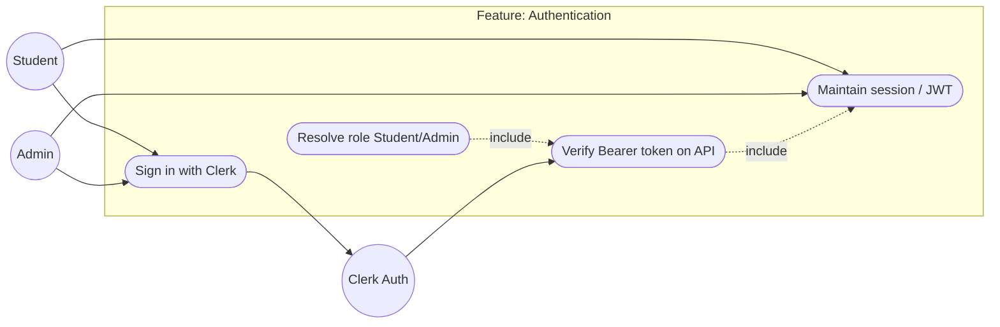

| Field | Detail |
|---|---|
| **Actors** | Student, Admin, Clerk |
| **Goal** | Establish trusted identity for API calls |
| **Preconditions** | Valid Clerk application; user has account or invitation |
| **Main success** | SPA holds JWT; API accepts `Authorization: Bearer …` |
| **Postconditions** | `customAuth.userId` available; role resolved for admin routes |
| **Exceptions** | Missing/invalid token → 401; non-admin on admin route → 403 |

---

### 4.3 F2 — Browse & view events

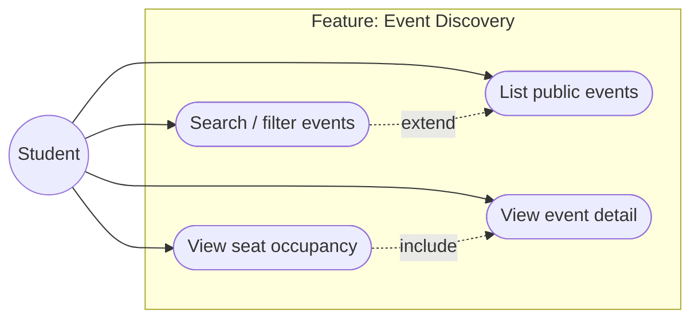

| Field | Detail |
|---|---|
| **Actor** | Student (guest may list if SPA allows; seats require auth in API) |
| **Main flow** | Open events page → API returns published/ongoing/completed → open detail |
| **Extensions** | `?search=`, `?featured=true`, `?status=` |
| **API** | `GET /api/events`, `GET /api/events/:id`, `GET /api/events/:id/seats` |

---

### 4.4 F3 — Favorite event

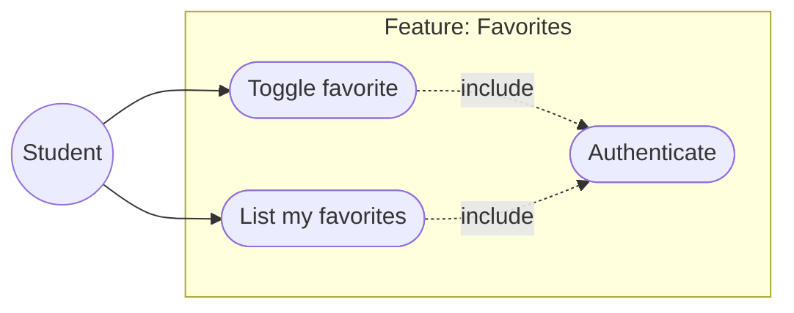

| Field | Detail |
|---|---|
| **Rules** | Unique `(user_id, event_id)`; toggle add/remove |
| **API** | `POST /api/favorites/toggle`, `GET /api/favorites/me` |

---

### 4.5 F4 — Book event (register) — detailed

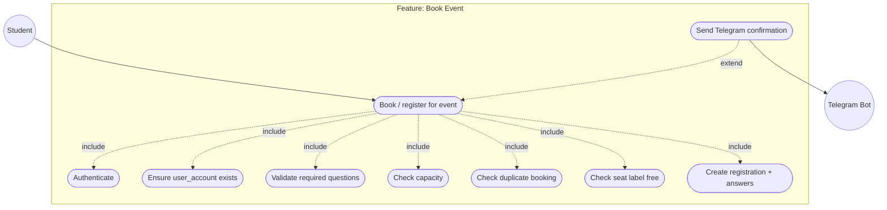

| Field | Detail |
|---|---|
| **Preconditions** | Event `published`, not deleted; student authenticated |
| **Postconditions** | `registration` row; reference `CADT-YYYYMMDD-XXXX`; optional Telegram |
| **Failures** | 404 not available; 409 full / already booked / seat taken; 400 missing answers |
| **API** | `POST /api/bookings` body `{ eventId, seatLabel?, answers? }` |

---

### 4.6 F5 — Cancel booking

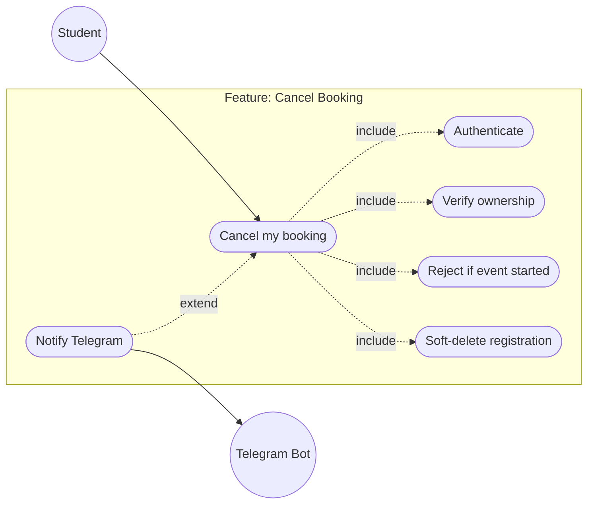

| Field | Full detail |
|---|---|
| **Preconditions** | Student owns active registration; event not started |
| **Postconditions** | `deleted_at` set; capacity freed; optional Telegram |
| **Exceptions** | 404 not found/not owner; 400 past event |
| **Full write-up** | §3A F5 |

---

### 4.7 F6 — View my bookings

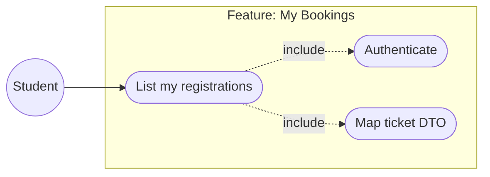

| Field | Full detail |
|---|---|
| **API** | `GET /api/bookings/me` |
| **Returns** | Active registrations + event summary + booking reference |
| **Full write-up** | §3A F6 |

---

### 4.8 F7 — Link Telegram

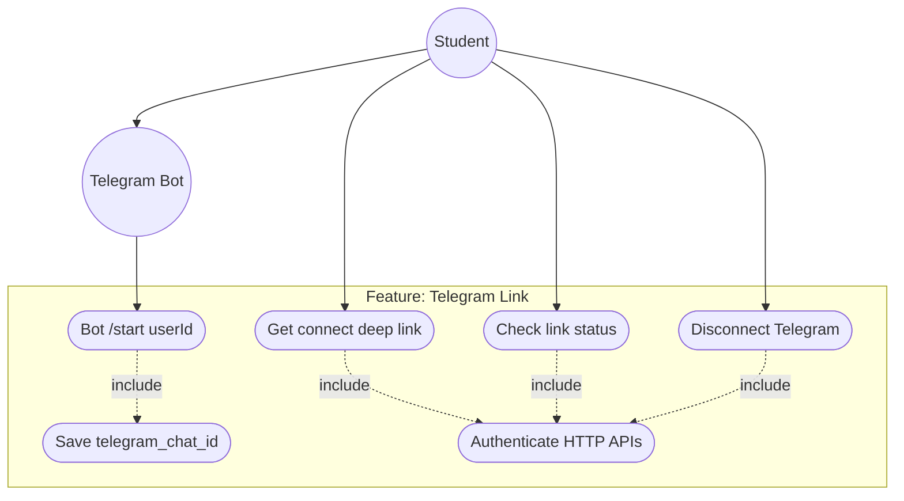

| Field | Full detail |
|---|---|
| **APIs** | connect, status, disconnect + bot polling |
| **Data** | `telegram_chat_id` on `user_account` + Clerk metadata |
| **Full write-up** | §3A F7 (F7a–F7d) |

---

### 4.9 F8 — Admin manage event (create / update / publish)

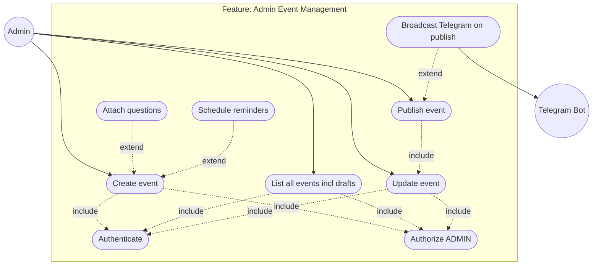

| Field | Detail |
|---|---|
| **Statuses** | `draft` → `published` (also ongoing/completed/cancelled in schema) |
| **Side effect** | Publish triggers Telegram to all users with `telegram_chat_id` |
| **API** | `POST /api/events`, `PATCH /api/events/:id`, `GET /api/events/all` |
| **Validation** | Zod CreateEventSchema / UpdateEventSchema |
| **Full write-up** | §3A F8 (F8a–F8c) |

---

### 4.10 F9 — Delete event

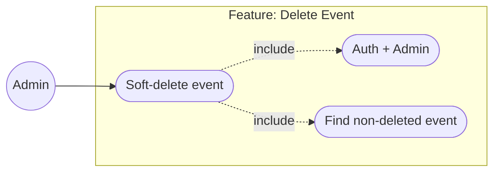

| Field | Full detail |
|---|---|
| **API** | `DELETE /api/events/:id` |
| **Effect** | `deleted_at = now` (not hard delete) |
| **Full write-up** | §3A F9 |

---

### 4.11 F10 — View event bookings (admin)

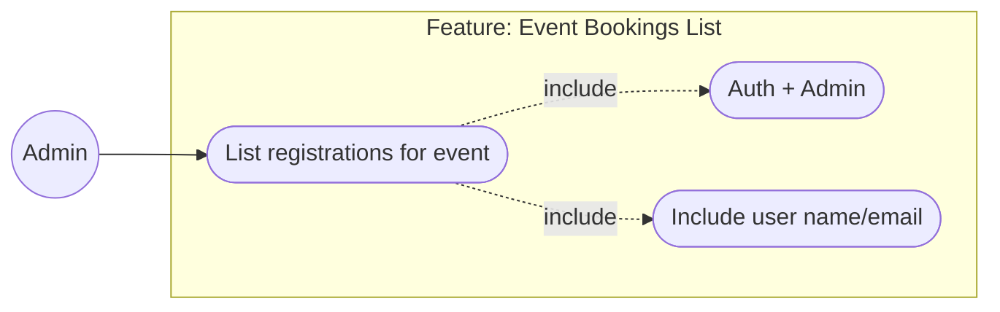

| Field | Full detail |
|---|---|
| **API** | `GET /api/bookings/event/:eventId` |
| **Order** | `created_at` ascending (registration order) |
| **Full write-up** | §3A F10 |

---

### 4.12 F11 — Check-in attendee

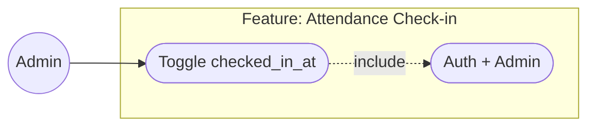

| Field | Full detail |
|---|---|
| **API** | `PATCH /api/bookings/:id/checkin` |
| **Behavior** | Toggle: set now or clear |
| **Credits impact** | Admin user credits count only checked-in regs |
| **Full write-up** | §3A F11 |

---

### 4.13 F12 — Upload cover image

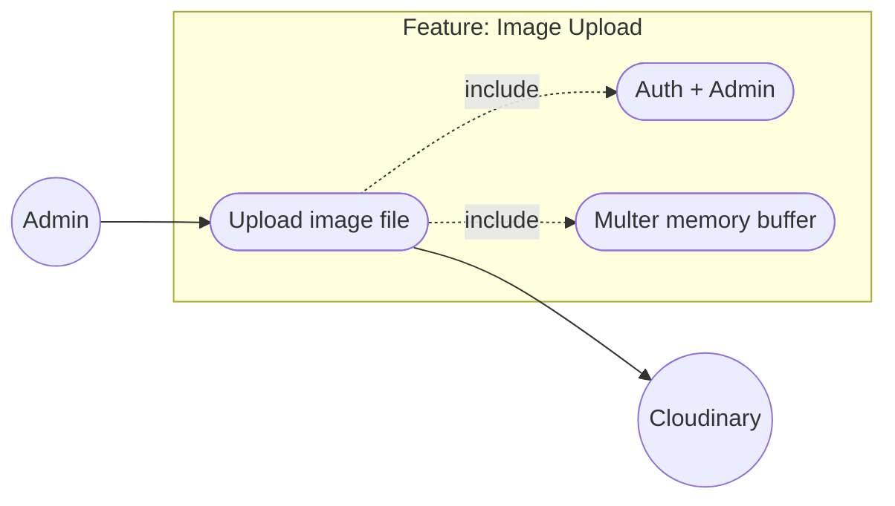

| Field | Full detail |
|---|---|
| **API** | `POST /api/upload` field `image` |
| **Result** | `{ url, public_id }` for event `coverImageUrl` |
| **Full write-up** | §3A F12 |

---

### 4.14 F13 — Manage users (admin)

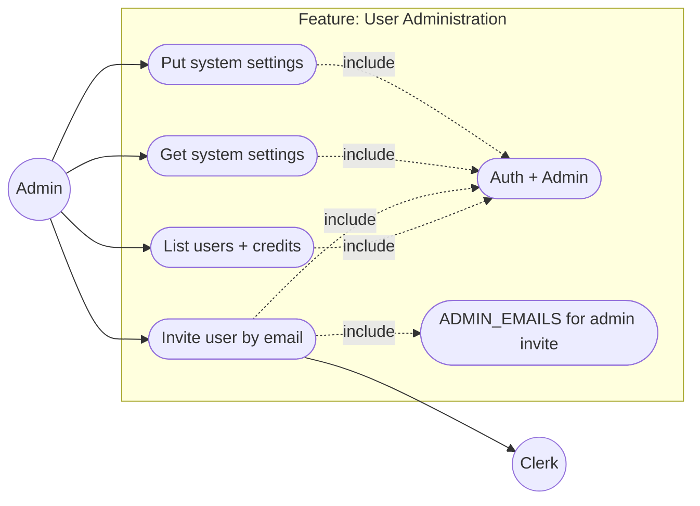

| Field | Full detail |
|---|---|
| **APIs** | `GET /users`, `POST /users/invite`, `GET/PUT /users/settings` |
| **Full write-up** | §3A F13 (F13a–F13c) |

---

### 4.15 F14 — Clerk user sync (webhook)

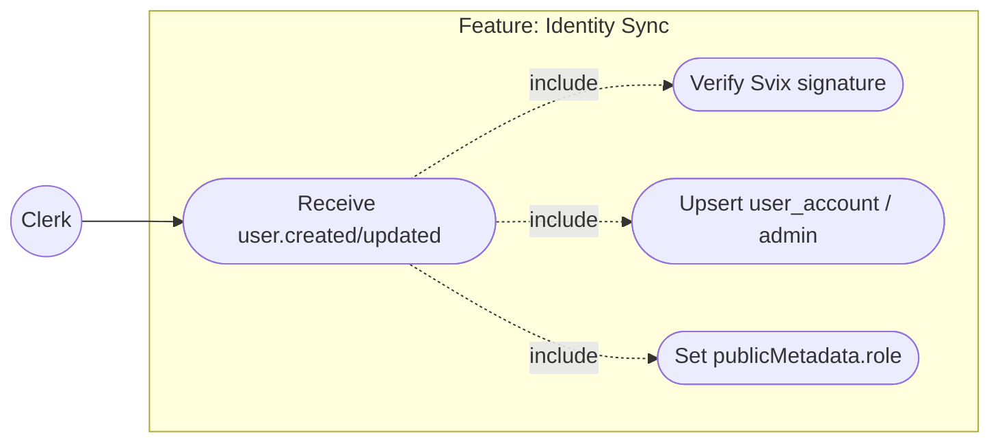

| Field | Full detail |
|---|---|
| **API** | `POST /api/webhooks/` raw body |
| **Full write-up** | §3A F14 |

---

### 4.16 F15 — Event reminders (cron)

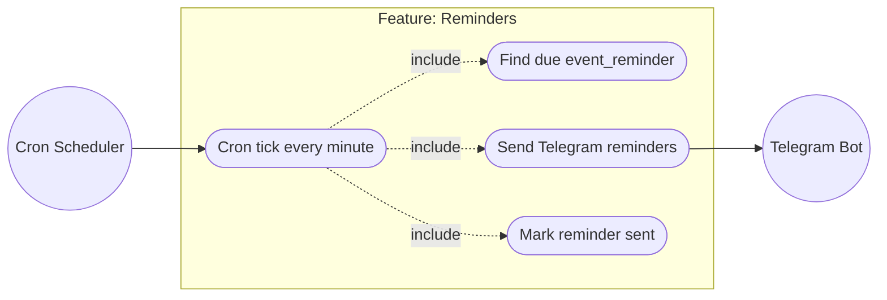

| Field | Full detail |
|---|---|
| **Schedule** | `* * * * *` node-cron |
| **Full write-up** | §3A F15 |

---

### 4.17 F16 — In-app notifications

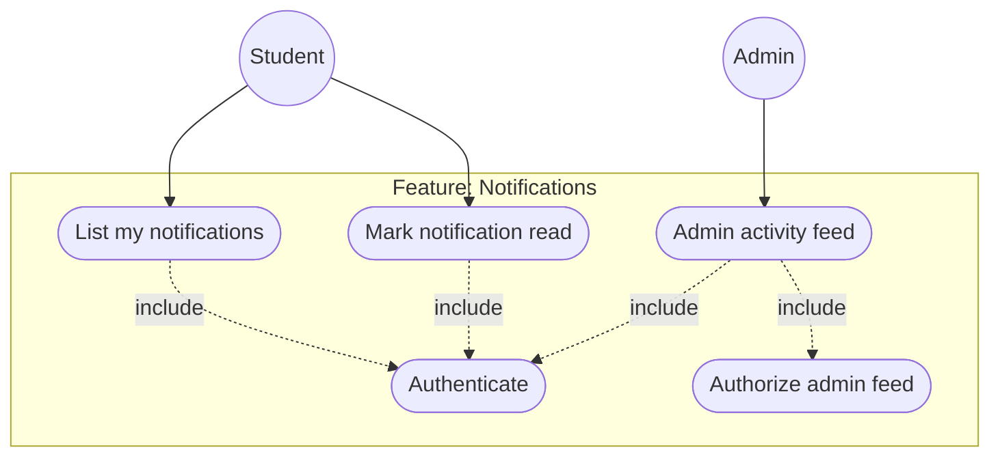

| Field | Full detail |
|---|---|
| **APIs** | `GET /notifications/me`, `PATCH /:id/read`, `GET /notifications/admin` |
| **Full write-up** | §3A F16 |

---

### 4.18 F17 — Health check

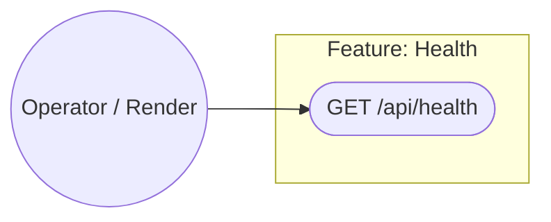

| Field | Full detail |
|---|---|
| **Response** | `{ status, env, timestamp }` |
| **Full write-up** | §3A F17 |

---

## 5. Activity diagrams

Each activity matches the **same feature** as the use case section.

### 5.1 F1 — Authenticate (activity)

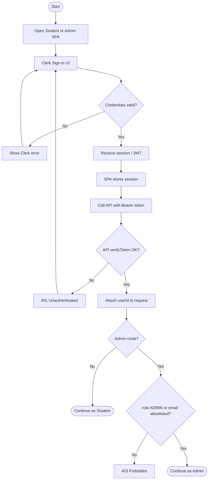

---

### 5.2 F2 — Browse & view events (activity)

```mermaid
flowchart TD
    A([Start]) --> B[Open Events page]
    B --> C[GET /api/events]
    C --> D[Render event cards]
    D --> E{User searches / filters?}
    E -->|Yes| F[GET /api/events?search=...]
    F --> D
    E -->|No| G{Open detail?}
    G -->|No| H([End browse])
    G -->|Yes| I[GET /api/events/:id]
    I --> J[Show detail + questions]
    J --> K{Need seat map?}
    K -->|Yes| L[GET /api/events/:id/seats + Auth]
    L --> M[Show occupied seats]
    M --> H
    K -->|No| H
```

---

### 5.3 F3 — Favorite event (activity)

```mermaid
flowchart TD
    A([Start]) --> B[Auth required]
    B --> C[User clicks favorite]
    C --> D[POST /favorites/toggle eventId]
    D --> E{Already favorited?}
    E -->|Yes| F[Delete favorite row]
    F --> G[Return action=removed]
    E -->|No| H[Insert favorite row]
    H --> I[Return action=added]
    G --> J([Update UI icon])
    I --> J
```

---

### 5.4 F4 — Book event (activity) — detailed

```mermaid
flowchart TD
    A([Start]) --> B[Student on event detail]
    B --> C[Optional: fill answers / pick seat]
    C --> D[Click Register]
    D --> E[POST /api/bookings + JWT]
    E --> F{Token valid?}
    F -->|No| Z1[401]
    F -->|Yes| G[Load/create user_account]
    G --> H{Event published & exists?}
    H -->|No| Z2[404]
    H -->|Yes| I{Required questions answered?}
    I -->|No| Z3[400]
    I -->|Yes| J{capacity full?}
    J -->|Yes| Z4[409 No seats]
    J -->|No| K{Already booked?}
    K -->|Yes| Z5[409 Duplicate]
    K -->|No| L{seatLabel set and taken?}
    L -->|Yes| Z6[409 Seat taken]
    L -->|No| M[Create registration + answers in TX]
    M --> N[Generate booking reference]
    N --> O[201 success to SPA]
    O --> P[Async Telegram notify if linked]
    P --> Q([Show confirmation / My Bookings])
```

---

### 5.5 F5 — Cancel booking (activity)

```mermaid
flowchart TD
    A([Start]) --> B[Open My Bookings]
    B --> C[Select booking → Cancel]
    C --> D[DELETE /api/bookings/:id]
    D --> E{Owned by user?}
    E -->|No| F[404]
    E -->|Yes| G{start_time in future?}
    G -->|No| H[400 Cannot cancel past]
    G -->|Yes| I[Set deleted_at]
    I --> J[Optional Telegram cancel msg]
    J --> K([List refreshed])
```

---

### 5.6 F6 — View my bookings (activity)

```mermaid
flowchart TD
    A([Start]) --> B[Auth]
    B --> C[GET /api/bookings/me]
    C --> D[Map registrations + events]
    D --> E([Render tickets / list])
```

---

### 5.7 F7 — Link Telegram (activity)

```mermaid
flowchart TD
    A([Start]) --> B[GET /api/telegram/connect]
    B --> C{Bot configured?}
    C -->|No| D[Show not configured]
    C -->|Yes| E[Open deep link t.me/bot?start=userId]
    E --> F[User opens Telegram]
    F --> G[Bot receives /start userId]
    G --> H[Find/create user_account]
    H --> I[Save telegram_chat_id]
    I --> J[Update Clerk metadata]
    J --> K[GET /api/telegram/status → connected]
    K --> L([Done])
```

---

### 5.8 F8 — Create / publish event (activity)

```mermaid
flowchart TD
    A([Start]) --> B[Admin opens Create Event]
    B --> C{Need cover image?}
    C -->|Yes| D[POST /api/upload]
    D --> E[Receive Cloudinary URL]
    E --> F[Fill form]
    C -->|No| F
    F --> G[POST /api/events draft or published]
    G --> H{Auth + ADMIN?}
    H -->|No| I[401/403]
    H -->|Yes| J[Validate dates & fields]
    J --> K[Insert event]
    K --> L{Questions?}
    L -->|Yes| M[createMany event_question]
    L -->|No| N{Reminders?}
    M --> N
    N -->|Yes| O[createMany event_reminder]
    N -->|No| P{status = published?}
    O --> P
    P -->|Yes| Q[Async Telegram broadcast]
    P -->|No| R([Saved as draft])
    Q --> S([Published & notified])
```

**Publish from draft (update path):**

```mermaid
flowchart TD
    A([Draft event]) --> B[Admin clicks Publish]
    B --> C[PATCH status=published]
    C --> D{Was already published?}
    D -->|Yes| E[Update fields only]
    D -->|No| F[Update + Telegram broadcast once]
    E --> G([Done])
    F --> G
```

---

### 5.9 F9 — Soft-delete event (activity)

```mermaid
flowchart TD
    A([Start]) --> B[Admin selects Delete]
    B --> C[DELETE /api/events/:id]
    C --> D{Exists & not deleted?}
    D -->|No| E[404]
    D -->|Yes| F[Set deleted_at = now]
    F --> G([Removed from active lists])
```

---

### 5.10 F10 — View event bookings (activity)

```mermaid
flowchart TD
    A([Start]) --> B[Admin opens event attendees]
    B --> C[GET /api/bookings/event/:eventId]
    C --> D[List user name, email, ref, check-in]
    D --> E([Manage attendance])
```

---

### 5.11 F11 — Check-in (activity)

```mermaid
flowchart TD
    A([Start]) --> B[Admin toggles check-in]
    B --> C[PATCH /api/bookings/:id/checkin]
    C --> D{checked_in_at set?}
    D -->|Yes| E[Clear checked_in_at]
    D -->|No| F[Set checked_in_at = now]
    E --> G([Return new state])
    F --> G
```

---

### 5.12 F12 — Upload image (activity)

```mermaid
flowchart TD
    A([Start]) --> B[Admin picks file]
    B --> C[POST multipart /api/upload]
    C --> D{Admin + file present?}
    D -->|No| E[400/401/403]
    D -->|Yes| F[Multer buffer → base64]
    F --> G[Cloudinary upload folder events]
    G --> H[Return secure_url]
    H --> I([Paste URL into event form])
```

---

### 5.13 F13 — Invite user (activity)

```mermaid
flowchart TD
    A([Start]) --> B[Admin enters email + role]
    B --> C{role = admin?}
    C -->|Yes| D{email in ADMIN_EMAILS?}
    D -->|No| E[400 not allowlisted]
    D -->|Yes| F[Clerk createInvitation]
    C -->|No| F
    F --> G[Email sent by Clerk]
    G --> H([201 invitation id])
```

---

### 5.14 F14 — Webhook user sync (activity)

```mermaid
flowchart TD
    A([Clerk event]) --> B[POST /api/webhooks raw body]
    B --> C{Svix headers present?}
    C -->|No| D[400]
    C -->|Yes| E[Verify signature]
    E --> F{Valid?}
    F -->|No| G[400]
    F -->|Yes| H{user.created or updated?}
    H -->|No| I[200 ignore]
    H -->|Yes| J[Upsert user_account by email]
    J --> K{email in ADMIN_EMAILS?}
    K -->|Yes| L[role ADMIN + upsert admin]
    K -->|No| M[role STUDENT metadata]
    L --> N[Update Clerk publicMetadata]
    M --> N
    N --> O([200 success])
```

---

### 5.15 F15 — Reminder cron (activity)

```mermaid
flowchart TD
    A([Cron fires]) --> B[Query event_reminder due & not sent]
    B --> C{Any due?}
    C -->|No| D([Idle])
    C -->|Yes| E[For each reminder load event + registrants with telegram]
    E --> F[Send Telegram messages]
    F --> G[Mark is_sent = true]
    G --> D
```

---

### 5.16 F16 — Notifications (activity)

```mermaid
flowchart TD
    A([Start]) --> B{Student or Admin?}
    B -->|Student| C[GET /api/notifications/me]
    C --> D[List notification rows]
    D --> E{Mark read?}
    E -->|Yes| F[PATCH /:id/read ownership check]
    F --> G[is_read = true]
    E -->|No| H([Inbox shown])
    G --> H
    B -->|Admin| I[GET /api/notifications/admin]
    I --> J{admin table row?}
    J -->|No| K[400 Not authorized]
    J -->|Yes| L[Load recent regs + events]
    L --> M[Merge sort synthetic feed]
    M --> N([Admin feed UI])
```

---

### 5.17 F17 — Health (activity)

```mermaid
flowchart TD
    A([Probe]) --> B[GET /api/health]
    B --> C[Return ok + env + timestamp]
    C --> D([Monitor green])
```

---

## 6. Sequence diagrams

### 6.1 F4 — Book event (primary student flow)

```mermaid
sequenceDiagram
    autonumber
    actor Student
    participant SPA as Student SPA
    participant API as Express API
    participant Auth as requireAuth / Clerk
    participant DB as PostgreSQL (Prisma)
    participant TG as Telegram Bot

    Student->>SPA: Register for event (+ seat/answers)
    SPA->>API: POST /api/bookings + Bearer JWT
    API->>Auth: verifyToken(JWT)
    alt invalid token
        Auth-->>SPA: 401
    else valid
        Auth-->>API: userId
        API->>DB: find/create user_account
        API->>DB: BEGIN transaction
        API->>DB: load event published
        API->>DB: count registrations / capacity
        API->>DB: find existing registration
        opt seatLabel provided
            API->>DB: find registration with seat
        end
        alt conflict / not found / validation
            API->>DB: ROLLBACK
            API-->>SPA: 4xx / 409
        else ok
            API->>DB: insert registration + answers
            API->>DB: COMMIT
            API-->>SPA: 201 booking + reference
            SPA-->>Student: Confirmation UI
            opt user has telegram_chat_id
                API--)TG: notifyUserViaTelegram (async)
                TG-->>Student: Confirmation message
            end
        end
    end
```

---

### 6.2 F2 — Browse event detail

```mermaid
sequenceDiagram
    autonumber
    actor Student
    participant SPA as Student SPA
    participant API as Express API
    participant DB as PostgreSQL

    Student->>SPA: Open Events
    SPA->>API: GET /api/events
    API->>DB: findMany status in published/ongoing/completed
    DB-->>API: events + registration counts
    API-->>SPA: { success, data[] }
    SPA-->>Student: Event grid

    Student->>SPA: Open event card
    SPA->>API: GET /api/events/:id
    API->>DB: findFirst + questions
    DB-->>API: event
    API-->>SPA: detail DTO
    SPA-->>Student: Detail page
```

---

### 6.3 F3 — Toggle favorite

```mermaid
sequenceDiagram
    autonumber
    actor Student
    participant SPA as Student SPA
    participant API as Express API
    participant DB as PostgreSQL

    Student->>SPA: Click heart
    SPA->>API: POST /api/favorites/toggle { eventId }
    API->>API: requireAuth
    API->>DB: ensure user + event exists
    API->>DB: find unique favorite
    alt exists
        API->>DB: delete favorite
        API-->>SPA: action=removed
    else not exists
        API->>DB: create favorite
        API-->>SPA: action=added
    end
    SPA-->>Student: Update icon
```

---

### 6.4 F5 — Cancel booking

```mermaid
sequenceDiagram
    autonumber
    actor Student
    participant SPA as Student SPA
    participant API as Express API
    participant DB as PostgreSQL
    participant TG as Telegram

    Student->>SPA: Cancel booking
    SPA->>API: DELETE /api/bookings/:id
    API->>DB: find registration owned by user
    alt not found
        API-->>SPA: 404
    else event already started
        API-->>SPA: 400
    else ok
        API->>DB: update deleted_at
        API-->>SPA: success
        API--)TG: cancel notification (async)
        SPA-->>Student: Removed from list
    end
```

---

### 6.5 F7 — Link Telegram account

```mermaid
sequenceDiagram
    autonumber
    actor Student
    participant SPA as Student SPA
    participant API as Express API
    participant Bot as Telegram Bot
    participant DB as PostgreSQL
    participant Clerk as Clerk API

    Student->>SPA: Connect Telegram
    SPA->>API: GET /api/telegram/connect
    API-->>SPA: deepLink t.me/bot?start=userId
    SPA-->>Student: Open link
    Student->>Bot: /start userId
    Bot->>DB: find/create user_account
    Bot->>DB: set telegram_chat_id
    Bot->>Clerk: publicMetadata.telegram_chat_id
    Bot-->>Student: Linked confirmation
    SPA->>API: GET /api/telegram/status
    API->>DB: read telegram_chat_id
    API-->>SPA: isConnected=true
```

---

### 6.6 F8 — Admin create & publish event

```mermaid
sequenceDiagram
    autonumber
    actor Admin
    participant ADM as Admin SPA
    participant API as Express API
    participant Auth as requireAuth + requireRole ADMIN
    participant DB as PostgreSQL
    participant TG as Telegram

    Admin->>ADM: Fill event form (optional image URL)
    ADM->>API: POST /api/events (status DRAFT|PUBLISHED)
    API->>Auth: verify + admin role
    alt not admin
        Auth-->>ADM: 401/403
    else ok
        API->>DB: create event
        opt questions
            API->>DB: createMany event_question
        end
        opt reminderSchedules
            API->>DB: createMany event_reminder
        end
        API-->>ADM: 201 event
        opt status published
            API--)TG: notifyUsersOfPublishedEvent
        end
    end

    Note over Admin,TG: Later publish from draft
    Admin->>ADM: Publish
    ADM->>API: PATCH /api/events/:id { status: PUBLISHED }
    API->>DB: update status
    API--)TG: broadcast once if newly published
    API-->>ADM: updated event
```

---

### 6.7 F11 — Admin check-in

```mermaid
sequenceDiagram
    autonumber
    actor Admin
    participant ADM as Admin SPA
    participant API as Express API
    participant DB as PostgreSQL

    Admin->>ADM: Toggle check-in on attendee
    ADM->>API: PATCH /api/bookings/:id/checkin
    API->>API: requireAuth + requireRole ADMIN
    API->>DB: find registration
    alt missing
        API-->>ADM: 404
    else present
        API->>DB: set checked_in_at = now or null
        API-->>ADM: { id, checkedInAt }
        ADM-->>Admin: UI reflects attendance
    end
```

---

### 6.8 F12 — Upload image

```mermaid
sequenceDiagram
    autonumber
    actor Admin
    participant ADM as Admin SPA
    participant API as Express API
    participant CL as Cloudinary

    Admin->>ADM: Choose image file
    ADM->>API: POST /api/upload multipart image
    API->>API: requireAuth + ADMIN
    alt no file
        API-->>ADM: 400
    else ok
        API->>CL: upload base64 (folder events)
        CL-->>API: secure_url, public_id
        API-->>ADM: { url }
        ADM-->>Admin: Preview cover
    end
```

---

### 6.9 F14 — Clerk webhook sync

```mermaid
sequenceDiagram
    autonumber
    participant Clerk
    participant API as Express /api/webhooks
    participant Svix as Svix verify
    participant DB as PostgreSQL
    participant ClerkAPI as Clerk Client

    Clerk->>API: POST user.created (raw body + svix headers)
    API->>Svix: verify(CLERK_WEBHOOK_SECRET)
    alt bad signature
        API-->>Clerk: 400
    else ok
        API->>DB: upsert user_account by email
        alt email in ADMIN_EMAILS
            API->>DB: upsert admin
            API->>ClerkAPI: publicMetadata.role=ADMIN
        else
            API->>ClerkAPI: publicMetadata.role=STUDENT
        end
        API-->>Clerk: 200 success
    end
```

---

### 6.10 F15 — Reminder cron

```mermaid
sequenceDiagram
    autonumber
    participant Cron as node-cron
    participant Svc as telegram.cron / service
    participant DB as PostgreSQL
    participant TG as Telegram API

    Cron->>Svc: scheduled tick
    Svc->>DB: find event_reminder where due and not sent
    loop each reminder
        Svc->>DB: load event + registrations with chat id
        Svc->>TG: send reminder messages
        Svc->>DB: is_sent = true
    end
```

---

### 6.11 End-to-end “happy path” (student + admin collaboration)

```mermaid
sequenceDiagram
    autonumber
    actor Admin
    actor Student
    participant API
    participant DB
    participant TG

    Admin->>API: POST /api/events published
    API->>DB: save event
    API--)TG: broadcast new event
    Student->>API: GET /api/events
    API->>DB: list
    API-->>Student: events
    Student->>API: POST /api/bookings
    API->>DB: registration
    API--)TG: booking confirm
    Admin->>API: GET /api/bookings/event/:id
    API-->>Admin: attendee list
    Admin->>API: PATCH checkin
    API->>DB: checked_in_at
```

---

### 6.12 F6 — View my bookings (sequence)

```mermaid
sequenceDiagram
    autonumber
    actor Student
    participant SPA as Student SPA
    participant API as Express API
    participant DB as PostgreSQL

    Student->>SPA: Open My Bookings
    SPA->>API: GET /api/bookings/me + JWT
    API->>API: requireAuth
    API->>DB: find user_account by userId
    alt user missing
        API-->>SPA: 404
    else ok
        API->>DB: findMany registrations deleted_at null include event
        DB-->>API: rows
        API-->>SPA: normalized ticket list
        SPA-->>Student: Render bookings
    end
```

---

### 6.13 F9 — Soft-delete event (sequence)

```mermaid
sequenceDiagram
    autonumber
    actor Admin
    participant ADM as Admin SPA
    participant API as Express API
    participant DB as PostgreSQL

    Admin->>ADM: Delete event
    ADM->>API: DELETE /api/events/:id
    API->>API: requireAuth + requireRole ADMIN
    API->>DB: find event deleted_at null
    alt not found
        API-->>ADM: 404
    else ok
        API->>DB: set deleted_at = now
        API-->>ADM: success
        Note over ADM: Event disappears from active lists
    end
```

---

### 6.14 F10 — View event bookings (sequence)

```mermaid
sequenceDiagram
    autonumber
    actor Admin
    participant ADM as Admin SPA
    participant API as Express API
    participant DB as PostgreSQL

    Admin->>ADM: Open attendees for event
    ADM->>API: GET /api/bookings/event/:eventId
    API->>API: requireAuth + ADMIN
    API->>DB: registrations for event include user
    DB-->>API: list
    API-->>ADM: DTO with name email check-in
    ADM-->>Admin: Attendee table
```

---

### 6.15 F13 — List users / invite / settings (sequence)

```mermaid
sequenceDiagram
    autonumber
    actor Admin
    participant ADM as Admin SPA
    participant API as Express API
    participant DB as PostgreSQL
    participant Clerk as Clerk API

    Admin->>ADM: Open Users
    ADM->>API: GET /api/users
    API->>DB: user_account + checked-in regs + admin
    API->>API: merge by email
    API-->>ADM: directory list

    Admin->>ADM: Invite email
    ADM->>API: POST /api/users/invite
    alt admin invite not allowlisted
        API-->>ADM: 400
    else ok
        API->>Clerk: createInvitation
        Clerk-->>API: invitation
        API-->>ADM: 201
    end

    Admin->>ADM: Save settings section
    ADM->>API: PUT /api/users/settings {section, values}
    API->>DB: upsert system_setting
    API-->>ADM: success
```

---

### 6.16 F16 — Notifications (sequence)

```mermaid
sequenceDiagram
    autonumber
    actor Student
    actor Admin
    participant SPA as SPA
    participant API as Express API
    participant DB as PostgreSQL

    Student->>SPA: Open notifications
    SPA->>API: GET /api/notifications/me
    API->>DB: findMany notification by user
    API-->>SPA: inbox
    Student->>SPA: Mark read
    SPA->>API: PATCH /api/notifications/:id/read
    API->>DB: update is_read if owner
    API-->>SPA: ok

    Admin->>SPA: Open admin bell feed
    SPA->>API: GET /api/notifications/admin
    API->>DB: find admin row
    API->>DB: recent registrations + events
    API-->>SPA: synthetic feed
```

---

### 6.17 F1 — Authenticate API call (sequence)

```mermaid
sequenceDiagram
    autonumber
    actor User
    participant SPA
    participant Clerk as Clerk
    participant API as Express API

    User->>SPA: Sign in
    SPA->>Clerk: Auth UI / session
    Clerk-->>SPA: Session + JWT
    User->>SPA: Perform action
    SPA->>API: Request + Authorization Bearer
    API->>API: verifyToken(secretKey)
    alt invalid
        API-->>SPA: 401
    else valid
        API->>API: customAuth.userId = sub
        opt requireRole ADMIN
            API->>Clerk: getUser(userId)
            API->>API: check role or ADMIN_EMAILS
            alt forbidden
                API-->>SPA: 403
            end
        end
        API-->>SPA: 2xx business result
    end
```

---

## 7. Class diagram

### 7.1 Domain class diagram (from Prisma schema)

Aligned to **live** models in `backend/prisma/schema.prisma` (simplified attributes for readability; types as used in DB).

```mermaid
classDiagram
    direction TB

    class UserAccount {
        +String user_id
        +String email
        +String full_name
        +UserRole role
        +String? student_staff_id
        +String? telegram_chat_id
        +String password_hash
        +AccountStatus account_status
        +DateTime? created_at
    }

    class Admin {
        +String admin_id
        +String email
        +String full_name
        +String password_hash
        +AdminLevel admin_level
        +DateTime? created_at
    }

    class Department {
        +String department_id
        +String department_name
        +String? specialization
    }

    class Event {
        +String event_id
        +String? admin_id
        +String? venue_id
        +String event_title
        +String? description
        +EventType event_type
        +EventStatus status
        +DateTime start_time
        +DateTime end_time
        +String? cover_image_url
        +String? location
        +Int? capacity
        +Int credit_value
        +Boolean? is_featured
        +DateTime? deleted_at
    }

    class Venue {
        +String venue_id
        +String venue_name
        +Int total_capacity
    }

    class Registration {
        +String registration_id
        +String booking_reference
        +String? qr_code
        +String user_id
        +String event_id
        +String? seat_label
        +DateTime? checked_in_at
        +DateTime? deleted_at
        +DateTime? created_at
    }

    class Favorite {
        +String favorite_id
        +String user_id
        +String event_id
        +DateTime? created_at
    }

    class EventQuestion {
        +String question_id
        +String event_id
        +String question_text
        +QuestionType question_type
        +String? options
        +Boolean is_required
        +Int order_index
    }

    class RegistrationAnswer {
        +String answer_id
        +String registration_id
        +String question_id
        +String answer_value
    }

    class Notification {
        +String notification_id
        +String user_id
        +String? event_id
        +String title
        +String message
        +NotificationType type
        +Boolean? is_read
    }

    class TelegramNotification {
        +String telegram_notification_id
        +String notification_id
        +String message_text
        +TelegramStatus status
    }

    class EventReminder {
        +String reminder_id
        +String event_id
        +Int minutes_before
        +DateTime scheduled_time
        +Boolean is_sent
    }

    class SystemSetting {
        +String key
        +String value
        +String? updated_by
        +DateTime updated_at
    }

    class Speaker {
        +String speaker_id
        +String speaker_name
        +String? title_role
    }

    class EventSpeaker {
        +String event_id
        +String speaker_id
    }

    class EventDepartment {
        +String event_id
        +String department_id
    }

    class EventSeat {
        +String event_seat_id
        +String event_id
        +String seat_template_id
        +EventSeatStatus status
    }

    class UserRole {
        <<enumeration>>
        student
        staff
        guest
    }

    class EventStatus {
        <<enumeration>>
        draft
        published
        ongoing
        completed
        cancelled
    }

    class EventType {
        <<enumeration>>
        workshop
        seminar
        competition
        conference
        career_fair
        networking
        other
    }

    UserAccount "1" --> "*" Registration : books
    Event "1" --> "*" Registration : receives
    UserAccount "1" --> "*" Favorite : saves
    Event "1" --> "*" Favorite : favorited
    Admin "0..1" --> "*" Event : manages
    Venue "0..1" --> "*" Event : hosts
    Department "0..1" --> "*" UserAccount : belongs
    Event "1" --> "*" EventQuestion : asks
    Registration "1" --> "*" RegistrationAnswer : answers
    EventQuestion "1" --> "*" RegistrationAnswer : answered_by
    UserAccount "1" --> "*" Notification : receives
    Event "0..1" --> "*" Notification : about
    Notification "1" --> "*" TelegramNotification : outbox
    Event "1" --> "*" EventReminder : schedules
    Event "1" --> "*" EventSpeaker : features
    Speaker "1" --> "*" EventSpeaker
    Event "1" --> "*" EventDepartment
    Department "1" --> "*" EventDepartment
    Event "1" --> "*" EventSeat : allocates
    UserAccount ..> UserRole
    Event ..> EventStatus
    Event ..> EventType
```

### 7.2 Multiplicity summary (exam-friendly)

| Association | Multiplicity | Meaning |
|---|---|---|
| UserAccount — Registration | 1 — * | One user many bookings |
| Event — Registration | 1 — * | One event many attendees |
| UserAccount — Favorite | 1 — * | Many favorites |
| Event — Favorite | 1 — * | Favorited by many users |
| UserAccount — Event (via Favorite) | * — * | M:N through Favorite |
| Admin — Event | 0..1 — * | Event may have creating admin |
| Event — EventQuestion | 1 — * | Dynamic form fields |
| Registration — RegistrationAnswer | 1 — * | Answers per booking |

### 7.3 Application-layer classes (backend design)

Conceptual controllers/services as used in code (not all are separate classes; shown for SE structure).

```mermaid
classDiagram
    direction LR

    class ExpressApp {
        +createApp()
    }
    class AuthMiddleware {
        +requireAuth()
        +requireRole(role)
    }
    class ErrorHandler {
        +errorHandler()
    }
    class AppError {
        +status: number
        +message: string
        +code?: string
    }
    class EventsController {
        +listEvents()
        +getEvent()
        +createEvent()
        +updateEvent()
        +deleteEvent()
        +getEventSeats()
    }
    class BookingsController {
        +createBooking()
        +getMyBookings()
        +cancelBooking()
        +getEventBookings()
        +checkInBooking()
    }
    class FavoritesController {
        +getMyFavorites()
        +toggleFavorite()
    }
    class UsersController {
        +listAllUsers()
        +inviteUser()
        +getSettings()
        +putSettings()
    }
    class TelegramService {
        +initTelegramBot()
        +notifyUserViaTelegram()
        +notifyUsersOfPublishedEvent()
    }
    class PrismaClient {
        +userAccount
        +event
        +registration
        +...
    }

    ExpressApp --> AuthMiddleware
    ExpressApp --> ErrorHandler
    ExpressApp --> EventsController
    ExpressApp --> BookingsController
    ExpressApp --> FavoritesController
    ExpressApp --> UsersController
    ExpressApp --> TelegramService
    EventsController --> PrismaClient
    BookingsController --> PrismaClient
    BookingsController --> TelegramService
    FavoritesController --> PrismaClient
    UsersController --> PrismaClient
    TelegramService --> PrismaClient
    ErrorHandler --> AppError
```

---

## 8. Traceability: full feature → write-up → diagrams → code

| Feature | Full text §3A | Use case | Activity | Sequence | Primary code |
|---|---|---|---|---|---|
| F1 Auth | F1 | 4.2 | 5.1 | 6.17 | `auth.middleware.ts`, `admins.ts` |
| F2 Browse / seats | F2 | 4.3 | 5.2 | 6.2 | `events.controller.ts` list/get/seats |
| F3 Favorite | F3 | 4.4 | 5.3 | 6.3 | `favorites.controller.ts` |
| F4 Book | F4 | 4.5 | 5.4 | 6.1 | `createBooking`, `CreateBookingSchema` |
| F5 Cancel | F5 | 4.6 | 5.5 | 6.4 | `cancelBooking` |
| F6 My bookings | F6 | 4.7 | 5.6 | 6.12 | `getMyBookings` |
| F7 Telegram | F7 | 4.8 | 5.7 | 6.5 | `telegram.controller/service` |
| F8 Event CRUD/publish | F8 | 4.9 | 5.8 | 6.6 | `create/update/listAllEvents` |
| F9 Delete event | F9 | 4.10 | 5.9 | 6.13 | `deleteEvent` |
| F10 Event bookings | F10 | 4.11 | 5.10 | 6.14 | `getEventBookings` |
| F11 Check-in | F11 | 4.12 | 5.11 | 6.7 | `checkInBooking` |
| F12 Upload | F12 | 4.13 | 5.12 | 6.8 | `upload.routes.ts` |
| F13 Users/settings | F13 | 4.14 | 5.13 | 6.15 | `users.controller.ts` |
| F14 Webhook | F14 | 4.15 | 5.14 | 6.9 | `webhooks/clerk.routes.ts` |
| F15 Reminder | F15 | 4.16 | 5.15 | 6.10 | `telegram.cron.ts` |
| F16 Notifications | F16 | 4.17 | 5.16 | 6.16 | `notifications.controller.ts` |
| F17 Health | F17 | 4.18 | 5.17 | (simple GET) | `app.ts` |
| E2E happy path | — | — | — | 6.11 | multi-module |
| Domain model | — | — | — | — | `schema.prisma` §7 |

---

## 9. Requirements snapshot (supporting UML)

### 9.1 Functional (selected)

| ID | Requirement | Feature |
|---|---|---|
| FR-01 | Students can list and open published events | F2 |
| FR-02 | Students can register with capacity enforcement | F4 |
| FR-03 | Students can cancel future bookings | F5 |
| FR-04 | Students can favorite events | F3 |
| FR-05 | Admins can create/update/publish/delete events | F8–F9 |
| FR-06 | Admins can list attendees and toggle check-in | F10–F11 |
| FR-07 | System authenticates via Clerk | F1, F14 |
| FR-08 | Optional Telegram link and notifications | F7, F4 extend, F8 extend, F15 |
| FR-09 | In-app notification inbox + admin feed | F16 |
| FR-10 | Admin user directory, invite, settings | F13 |
| FR-11 | Image upload for event covers | F12 |
| FR-12 | Identity webhook sync | F14 |
| FR-13 | Health probe for deployment | F17 |

### 9.2 Non-functional (selected)

| ID | Category | Requirement |
|---|---|---|
| NFR-01 | Security | Bearer JWT; admin role checks |
| NFR-02 | Integrity | Capacity and duplicate booking rules |
| NFR-03 | Maintainability | Feature modules under `src/modules` |
| NFR-04 | Deployability | Health check; migrate on start |
| NFR-05 | Usability (system) | JSON envelopes `{ success, data }` for clients |

---

## 10. Conclusion

This Software Engineering report documents **CADT Events** with the four UML types emphasized by the course:

1. **Use case diagrams** — system overview plus **separate detailed diagrams per feature** (F1–F15), with include/extend relationships.  
2. **Activity diagrams** — same feature set, showing decisions (capacity, auth, publish, webhook verify).  
3. **Sequence diagrams** — runtime collaboration among SPA, API, DB, Clerk, Telegram, Cloudinary, and Cron.  
4. **Class diagrams** — domain model from Prisma and application-layer controllers/services.

Diagrams are **traceable to the implemented backend**, so the SE design matches the running product rather than an outdated JWT-only prototype.

### How to present to teacher

| Order | What to show | Section |
|---|---|---|
| 1 | Actors + system context | §2 |
| 2 | Overview use case | §4.1 |
| 3 | Pick 3–4 deep features: **Book**, **Publish event**, **Telegram link**, **Check-in** | §4 + §5 + §6 |
| 4 | Full class diagram | §7.1 |
| 5 | Traceability table | §8 |

### Optional export

- Render Mermaid in GitHub / VS Code / [mermaid.live](https://mermaid.live) → PNG for PowerPoint.  
- Or regenerate in Draw.io / StarUML using the same actors and associations.

---

## References

1. Course UML / SE lecture materials  
2. `docs/product/prd.md`  
3. `docs/architecture/software-engineering/use-cases.md` (historical; this report supersedes for live Clerk/booking flows)  
4. `docs/architecture/software-engineering/uml.md`  
5. `backend/prisma/schema.prisma`, `backend/src/modules/**`  
6. `docs/report/5-backend-report.md`  

---

## Checklist (submission)

- [x] **Full written specification for every feature** (§3A F1–F17)  
- [x] Use case overview  
- [x] Use case **per feature** (F1–F17)  
- [x] Activity **per feature** (F1–F17)  
- [x] Sequence diagrams for **all major features** (incl. F1, F6, F9–F10, F13, F16)  
- [x] Domain class diagram + app layer  
- [x] Include/extend and multiplicities  
- [x] Business rules, exceptions, APIs, data entities per feature  
- [x] Traceability table feature → §3A → diagrams → code  
- [ ] Team names / IDs on cover  
- [ ] Export diagrams to images if lecturer requires non-Mermaid  
- [ ] Print/PDF if required  

---

*End of Software Engineering Report — CADT Events v1.1 (full feature detail + UML)*
